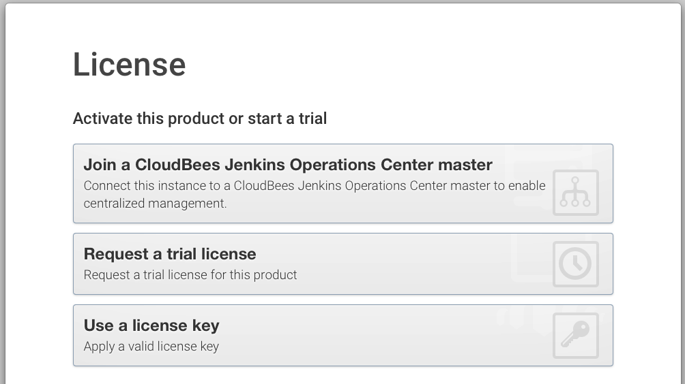
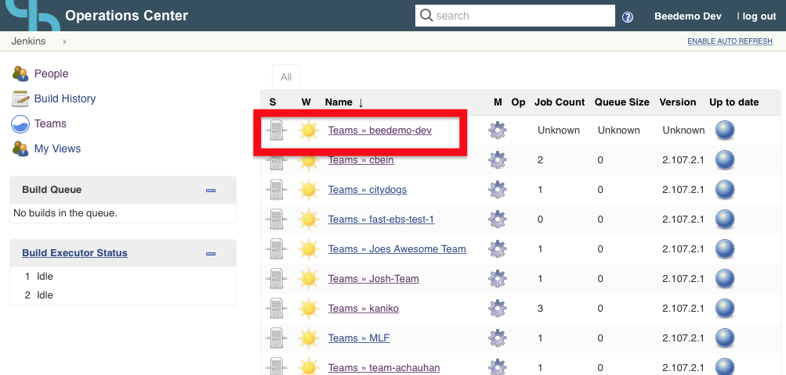
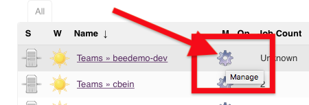
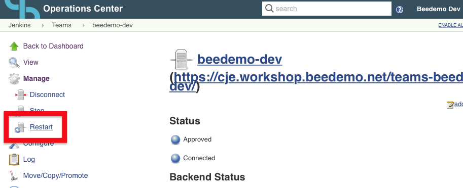
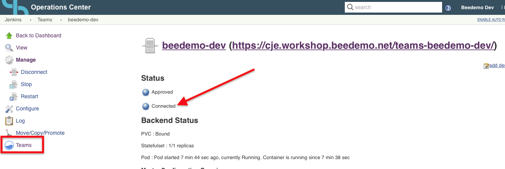
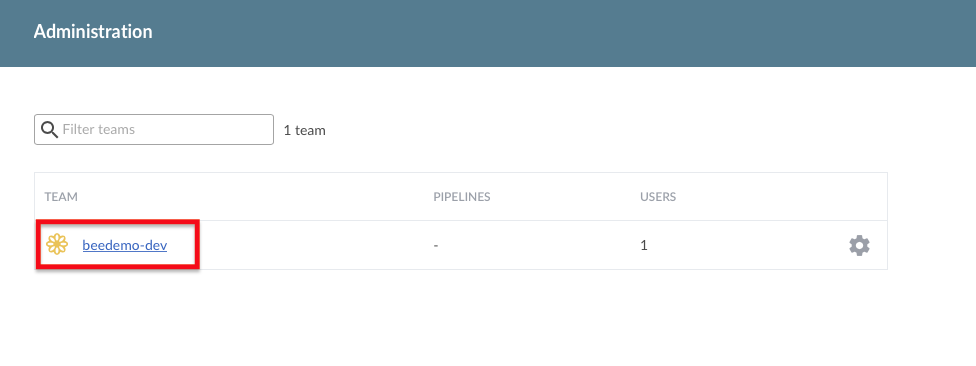

# License Screen on Team Creation
After your team has been successfully created, you should see the following **Create a new Pipeline** screen: 

  
If you instead see the following screen: 

Please follow these instructions:

1. In your browser, navigate to https://cje.workshop.beedemo.net/cjoc/ 

2. Find your Team (master) in the list and click on the **cog icon** next to your master 

3. Click the **Restart** link in the left menu under **Manage** and in the dialog that pops up click **OK** 

4. Once you see a **Connected** Status for your Team (in 3-5 minutes) click on the **Teams** link in the left menu 

5. Click on your Team and you should then see the **Create a new Pipeline** screen 
