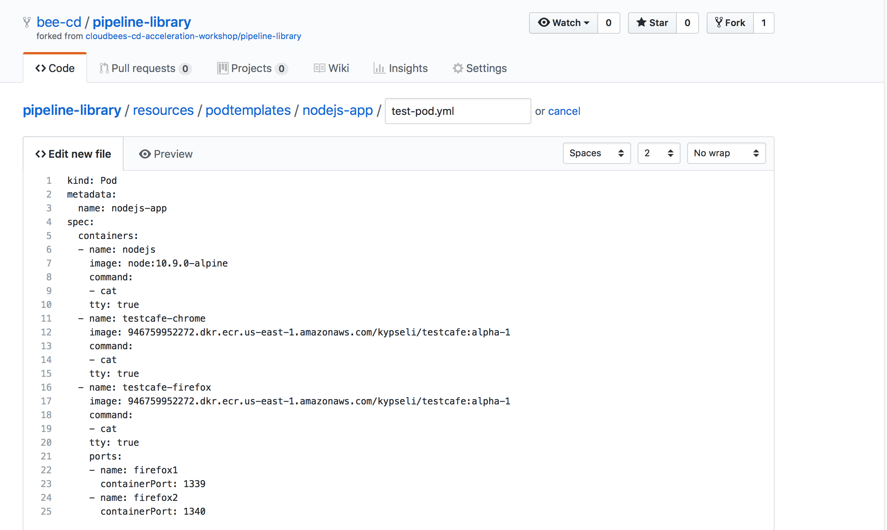

# Advanced Pipelines with CloudBees Core

In this set of exercise we are going to explore [Pipeline Shared Libraries](https://jenkins.io/doc/book/pipeline/shared-libraries/) and use a shared set of **custom steps** to make our Declartive Pipeline more readable, build a Docker image for the **helloworld-nodejs** app, push that Docker image to an [AWS ECR](https://aws.amazon.com/ecr/) and deploy the **helloworld-nodejs** app to Kubernetes. But before we do all of that we will update the **nodejs-app/Jenkinsfile.template** Pipeline script to be more dynamic.

We will also take a look at the [CloudBees Core Cross Team Collaboration feature](https://go.cloudbees.com/docs/cloudbees-core/cloud-admin-guide/cross-team-collaboration/#) and how it can improve team collaboration by connecting Team Pipelines to deliver software faster. 

>**Starting Here or Catching Up?**
>
>If you are starting with this set of exercises or just need to catch up, you may get the the correct version of the  **nodejs-app/Jenkinsfile.template** Pipeline script for starting these exercises [from this branch](https://github.com/cloudbees-cd-acceleration-workshop/custom-marker-pipelines/blob/after-parallel/nodejs-app/Jenkinsfile.template).

## Dyanmic Properties for Pipelines

The **Custom Marker** feature of CloudBees Core provides a lot of control and easy management of Pipelines for you dev teams' Pipelines. But it does not give individual teams a lot of flexibility. In this exercise we are going to update the **nodejs-app/Jenkinsfile.template** Pipeline script to read in the `.nodejs-app` marker file from the  **helloworld-nodejs** repository as a properties file using the [`readProperties` step](https://jenkins.io/doc/pipeline/steps/pipeline-utility-steps/#readproperties-read-properties-from-files-in-the-workspace-or-text) of [Pipeline Utilities plugin](https://jenkins.io/doc/pipeline/steps/pipeline-utility-steps/).

We have been installing two specific Node.js packages - `express` and `pug` - for everyone but what if there are dev teams that want to use different or additional packages. We can allow individual teams to set a `npmPackages` propety in the `.nodejs-app` marker file and then load that file with `readProperties` step and then use that value to override the packages installed in the `nodejs` `container` steps.

1. Open the GitHub editor for the **nodejs-app/Jenkinsfile.template** Pipeline script in the **master** branch of your forked **custom-marker-pipelines** repository.
2. The `readProperties` step will read a file in the current working directory and return a map of String keys and values. Therefore we will have to define a Groovy variable to caputre this returned map, but the Declarative syntax does not allow defining or assigning values to variables. So we will once again use the `script` block so that we can assign the output of the `readProperties` step to use in our `nodejs` steps. Add the following `script` block right after the `checkout scm` step of the **Test** `stage`:

```
            script {
              //use the Pipeline Utility Steps plugin readProperties step to read the .nodejs-app custom marker file 
              def props = readProperties file: '.nodejs-app'
              env.npmPackages = props['npmPackages']
            }
```

3. Next replace the `npm i -S express pug` of the `nodejs` `sh` step with the value of the `npmPackages` property - we also need to use triple double-quotes instead of triple single-quotes to [support the interpolation](https://jenkins.io/doc/book/pipeline/jenkinsfile/#string-interpolation) of our `npmPackages` variable. The entire `nodejs` `container` block will be:

```
            container('nodejs') {
              sh """
                npm i -S ${npmPackages}
                node ./hello.js &
              """
            }
```

4. Commit the changes and then navigate to the **master** branch of your **helloworld-nodejs** job in Blue Ocean on your Team Master and run the job. The browser tests will both fail because we didn't add `npmPackages` property to the `.nodejs-app` marker file in the **helloworld-nodejs** repository: <p>  <p>However, the **express** framework and **pug** templating are what the majority of the dev teams use for Node.js development. So what we really want is to have a default value set, and then allow different dev teams to override that value if they are using different packages. Lucky for us, the `readProperties` step includes a parameter aptly named `defaults` that allows us to provide a map containing default key/values. We will update the `readProperties` script block with a map of default values and add the `defaults` parameter set to that map:

```
            script {
              //define default values that may be overridden via the .nodejs-app file
              def d = [npmPackages: 'express pug']
              //use the Pipeline Utility Steps plugin readProperties step to read the .nodejs-app custom marker file 
              def props = readProperties defaults: d, file: '.nodejs-app'
              env.npmPackages = props['npmPackages']
            }
```

5. Commit the changes and then navigate to the **master** branch of your **helloworld-nodejs** job in Blue Ocean on your Team Master and run the job. The job will complete successfully using our default values for `npmPackages`.

## Pipeline Shared Libraries

In this exercise we are going to add a *step* to our Pipeline from a [**Pipeline Shared Library**](https://jenkins.io/doc/book/pipeline/shared-libraries/), providing functionality to set default values based on default Jenkins environmental variables. But first, you will fork the Pipeline Shared Library for this exercise from https://github.com/cloudbees-cd-acceleration-workshop/pipeline-library into the GitHub Organization you created in **[Setup - Create a GitHub Organization](./Setup.md#create-a-github-organization)**.

Once you have forked the ***pipeline-library*** repository into your GitHub Organization you will need to configure it as a Pipeline Shared Library configuration for your Team Master. Pipeline Shared Libraries may be configured at the Jenkins Master level or the Jenkins folder level. The GitHub Oranization project that you created earlier is actually a special type of folder, so we will add the ***pipeline-library*** to that folder.

1. In the ***Github Organization** folder Jenkins project you started to create in the previous exercise scroll down to the **Pipeline Libraries** section and click the **Add** button. <p>
2. Enter `cd-accel` for the Library **Name** and `master` for the **Default version**.
3. Next for the **Retrieval method** select **Modern SCM**.
4. Then, for the **Source Code Management** select **GitHub**.
5. Select the GitHub **Credentials** you created earlier, enter your GitHub Organization name as the **Owner**, select **pipeline-library** for the **Repository** and then click the **Save** button. <p>

If you navigate back to your fork of the **pipeline-library** repository you will notice that all it has a *LICENSE* and *README.md* files. We need to create a specific direction structure in your forked **pipeline-library** repositories and then we will create our first shared library script.

### Pipeline Directory Structure

Shared Libraries have a very specific directory structure as follows:

```
(root)
+- src                     # Groovy source files
|   +- org
|       +- foo
|           +- Bar.groovy  # for org.foo.Bar class
+- vars
|   +- foo.groovy          # for global 'foo' variable
|   +- foo.txt             # help for 'foo' variable
+- resources               # resource files (external libraries only)
|   +- org
|       +- foo
|           +- bar.json    # static helper data for org.foo.Bar
```

The `src` directory should look like standard Java source directory structure and will contain Java `Classes` written in `Groovy`. This directory is added to the classpath when executing Pipelines.

The `vars` directory hosts scripts that define global variables accessible from Pipeline. The basename of each `.groovy` file should be a Groovy (~ Java) identifier, conventionally `camelCased`. The matching `.txt`, if present, can contain documentation, processed through the system’s configured markup formatter (so may really be HTML, Markdown, etc., though the `txt` extension is required).

The Groovy source files in these directories get the same “CPS transformation” as in Scripted Pipeline.

A `resources` directory allows the `libraryResource` step to be used from an external library to load associated non-Groovy files. Currently this feature is not supported for internal libraries.

### Create a Custom Step

For this workshop we will only be using the simpler and more straight-forward **global variables**, and we will also work with `resources` and the `libraryResource` step. But before we create a new **global variable** we need to decide what it needs to do. Pipeline Shared Libraries are like any other shared framework or utility - the purpose being to reduce redundant code and to aheare to [DRY](https://en.wikipedia.org/wiki/Don't_repeat_yourself). Also, with the advent of two different syntaxes for Pipelines - Declarative and Scripted - it is sometimes useful to use Shared Library [**custom steps**](https://jenkins.io/doc/book/pipeline/shared-libraries/#defining-custom-steps) to encapsulted Scripted syntax to use in a Declarative Pipeline. We will do just that for the `readProperties` `script` block that we added above. We will call it `defineProps` - we can't use `readProperties` because then our new **custom step** would override and replace the `readProperties` step from the Pipeline Utilities plugin and we will actually use that step in our custom step.

1. In the **master** branch of your forked **pipeline-library** repostiory click on the **Create new file** button and enter `vars/defineProps.groovy`. <p>
2. We will implement a `call` method as the `call` method allows the global variable to be invoked in a manner similar to a step:

```groovy
// vars/defineProps.groovy
def call(String file, Map defaults) {
  //use the Pipeline Utility Steps plugin readProperties step to read the .nodejs-app custom marker file 
  def props = readProperties defaults: defaults, file: file
  for ( e in props ) {
    env.setProperty(e.key, e.value)
  }
}
```

4. Commit the `defineProps.groovy` file. 
3. Next we will create a `defineProps.txt` file in the `vars` directory. This will provide dynamically generated documentation on whatever Jenkins instance the Shared Library is installed for our custom step:

```html
<h2>defineProps step</h2>
<p>
A custom step for using the <pre>readProperties</pre> step from the Pipeline Utilities plugin with a Declarative Pipeline. 
</p>
<h3>Configuration</h3>
<dl>
	<dt>name</dt>
	<dd><pre>String</pre><b>REQUIRED</b> the path to the properties file to be read from the workspace</dd>
	<dt>defaults</dt>
	<dd><pre>Map</pre><b>OPTIONAL</b> default values for passed in properties file</dd>
</dl>

<h3>Example:</h3>
<pre>
	defineProps('.nodejs-app', [npmPackages: 'express pug'])
</pre>
```

5. Commit the `defineProps.txt` file.

>**NOTE:** Global Variable Documentation for custom steps will only be availale under a Pipeline job that uses that step and has run successfully.

### Use a Custom Step

Now that the **Pipeline Shared Library** is configured for your Team Master and we have a **global variable** to use, we will use it in the `nodejs-app/Jenkinsfile.template` Pipeline script.

1. Open the GitHub editor for the **nodejs-app/Jenkinsfile.template** Pipeline script in the **master** branch of your forked **custom-marker-pipelines** repository.
2. Add the following line to the very top of the Pipeline script, above the `pipeline` block - remember that we named the Shared Library **cd-accel** when we added it to our GitHub Organization project on our Team Masters:

```
library 'cd-accel'
```

3. Next we will replace the `script` block where we are using the `readProperties` step with our new custom step. Update the  **App Setup** `stage` of the **Test** `stage` to match the following:

```groovy
        stage('App Setup') {
          steps {
            checkout scm
            defineProps('.nodejs-app', [npmPackages: 'express pug'])
            container('nodejs') {
              sh """
                npm i -S ${npmPackages}
                node ./hello.js &
              """
            }
          }
        }
```

4. Not only have we created a reusable custom step, we have also made our Declartive Pipeline script much more readable. Commit the changes and then navigate to the **master** branch of your **helloworld-nodejs** job in Blue Ocean on your Team Master and run the job. The job will run successfully. Note in **Console Output** in the classic UI the checkout of the our Shared Library: <p>
5. Exit to the class UI and click on the **Pipeline Syntax** link in the left navigation menu. Then click on the **Global Variables Reference** link and scroll to the bottom of the page. You will find the documentation that we created for our `defineProps` custom step: <p>

### Using Resource Files from a Shared Library

One of the Shared Library directories mentioned above was the `resource` directory. Shared Libraries will make files from the `resources/` directory available to be loaded in your Pipeline script using the `libraryResource` step. The argument is a relative pathname in the `resource` directory. The file is loaded as a string, suitable for passing to certain APIs or using as a the value for a `String` parameter of a Pipeline `step`. We are going to use such a `resource` for the latter use case - as a `String` of a Pipeline step. With our previous example, we made our Pipeline script more readable by replacing a `script` block with the `defineProps` **custom step**. Let's do something similar by replacing the inline yaml definition of our `kubernetes` agent with a `resource` from our Shared Library.

1. In the **master** branch of your forked **pipeline-library** repostiory click on the **Create new file** button and enter `resources/podtemplates/nodejs-app/test-pod.yml`. 
2. The contents of this file will be the `Pod` configuration from the `yaml` parameter of the `kubernetes` block in the **Test** `stage` of our Pipeline script. Copy and paste that as the content of this new `test-pod.yml` `resource` file: 

```
kind: Pod
metadata:
  name: nodejs-app
spec:
  containers:
  - name: nodejs
    image: node:10.9.0-alpine
    command:
    - cat
    tty: true
  - name: testcafe-chrome
    image: 946759952272.dkr.ecr.us-east-1.amazonaws.com/kypseli/testcafe:alpha-1
    command:
    - cat
    tty: true
  - name: testcafe-firefox
    image: 946759952272.dkr.ecr.us-east-1.amazonaws.com/kypseli/testcafe:alpha-1
    command:
    - cat
    tty: true
    ports:
    - name: firefox1
      containerPort: 1339
    - name: firefox2
      containerPort: 1340
```

<p>

3. Commit the changes.
4. Open the GitHub editor for the **nodejs-app/Jenkinsfile.template** Pipeline script in the **master** branch of your forked **custom-marker-pipelines** repository.
5. Just below the `library 'cd-accel'` step, add the following - *note that we are specifying the relative path to `test-pod.yml` from the `resources` directory*:

```groovy
def testPodYaml = libraryResource 'podtemplates/nodejs-app/test-pod.yml'
```

6. Next, update the the `yaml` argument the `kubernetes` so your `agent` for the **Test** `stage` matches the following and commit the changes:

```
      agent {
        kubernetes {
          label 'nodejs-app-inline'
          yaml testPodYaml
        }
      }
```

7. Wow, that really makes our Pipeline much more readable. Navigate to the **master** branch of your **helloworld-nodejs** job in Blue Ocean on your Team Master and run the job. The job will run successfull using the `yaml` definition from our Shared Library.

## Cross Team Collaboration
In this exercise we are going to set-up two Pipeline jobs (using the Jenkins classic UI) that demonstrate CloudBee's Cross Team Collaboration feature. We will need two separate Pipelines - one that publishes an event - and another that is triggered by an event.

### Master Events

For the first part of **Cross Team Collaboration** we will create an event that is only published on your master.

#### Publish Event

First you have to publish an event from a Pipeline - any other Pipeline may set a trigger to listen for this event. Create a Pipeline job named `notify-event` with the following content, but replace `<username>Event` with your username so my event would be `beedemoEvent`:

```
pipeline {
    agent none
    stages {
        stage('Publish Event') {
            steps {
                publishEvent simpleEvent('<username>Event')
            }
        }
    }
}
```

#### Event Trigger

Next, create a Pipeline job name `notify-trigger` and set a `trigger` to listen for the event you created above with the following content, again don't forget to edit `<username>Event`:

```
pipeline {
    agent none
    triggers {
        eventTrigger simpleMatch('<username>Event')
    }
    stages {
        stage('Event Trigger') {
            when {
                expression { 
                    return currentBuild.rawBuild.getCause(com.cloudbees.jenkins.plugins.pipeline.events.EventTriggerCause)
                }
            }
            steps {
                echo 'triggered by published event'
            }
        }
    }
}
```

After creating both of these Pipeline jobs you will need to run the **Event Trigger** job once so that the trigger is registered (similar to what was necessary for job parameters). Once that is complete, click on **Build Now** to run the **Publish Event** job. Once that job has completed, the **Event Trigger** job will be triggered after a few seconds. The logs will show that the job was triggered by an `Event Trigger` and the `when` expression will be true.

>**NOTE**:  If your *trigger* job does not fire, you may need to enable the **Cross Team Collaboration** feature on your master.  Navigate to the top level of your master, select **Manage Jenkins** and then **Configure Notification**.  Next, select **Enable** and choose **Local only** and then click **Save**.

### Cross-Master Events

For the second part of **Cross Team Collaboration** we will create an event that will be published **across Team Masters** via CloudBees Operations Center. The Cross Team Collaboration feature has a configurable router for routing events and we will change the router used for this exercise. You will need to select a partner to work with - one person will be the notifier and the other person will update their **event-trigger** job to be triggered when the notifier's job is run.

1. First you need to update the **Notification Router Implementation** to use the **Operations Center Messaging** router by clicking on the **Manage Jenkins** link - on the left side at the root of your Team Master (classic ui).
2. Next, scroll down and click on **Configure Notification** link.
3. Under **Notification Router Implementation** select the **Operations Center Messaging** option as opposed to the currently selected **Local only** option.
4. Now, the trigger job of the second partner needs to be updated to listen for the notifier's `event` string - ask your partner what their event string is - and then run the job once to register the trigger.
5. Next, the notifier will run their `notify-event` job and you will see the `notify-trigger` job get triggered.

## Advanced Jenkins Kubernetes Agents

In this exercise we will explore the [Jenkins Kubernetes plugin](https://github.com/jenkinsci/kubernetes-plugin) and will create a new pipeline job to use the `podTemplate` and `container` directives in your Declarative Pipeline. The plugin creates a [Kubernetes Pod](https://kubernetes.io/docs/concepts/workloads/pods/pod-overview/) for each agent requested by a Jenkins job, with at least one Docker container running as the JNLP agent, and stops the pod and all containers after the build is complete (or after a set amount of time as is the case here).

>NOTE: The **Jenksin Kubernetes Plugin** is automatically installed and configured to provision dynamic ephemeral agents by CloudBees Jenkins Enterprise on Kubernetes. 

1. Create a "New Item" and give it a name like "Advanced K8s Example" - choose the Pipeline type click OK.
2. Copy and paste the following code into the **Pipeline Script** text box near the bottom of the page:

```
pipeline {
  agent {
    kubernetes {
      label 'kubernetes'
      containerTemplate {
        name 'go'
        image 'golang:1.10.1-alpine'
        ttyEnabled true
        command 'cat'
      }
    }
  }
  stages {
    stage('golang in k8s') {
        steps {
            container('go') {
                sh 'go version'
            }
        }
    }
  }
}
```
**Note:** Notice the use of the **container** directive.  This tells Jenkins which container in a Pod to use for the steps in the stage.  In this exercise a single container (golang) was explicitly defined in the pipeline, however a second container is implicitly created to handle the JNLP communiction between Jenkins and the Pod.

```
pipeline {
  agent {
    kubernetes {
      label 'kubernetes'
      containerTemplate {
        name 'go'
        image 'golang:1.10.1-alpine'
        ttyEnabled true
        command 'cat'
      }
    }
  }
  stages {
    stage('golang in k8s') {
        steps {
            container('go') {
                sh 'go version'
            }
            container('jnlp') {
                sh 'java -version'
            }
        }
     }
  }
}
```
**Note:** In the above example you were able to execute a java command in the implicitly defined **jnlp** container in the Pod.  The JNLP container is a part of every Pod created by the Jenkins Kubernetes plugin.

