# Advanced Pipelines with CloudBees Core

In this set of exercise we will continue to explore [Pipeline Shared Libraries](https://jenkins.io/doc/book/pipeline/shared-libraries/) and use a Shared Library of **custom steps** to:
- make our Declarative Pipeline more readable
- build a Docker image for the **helloworld-nodejs** app with [Kaniko](https://github.com/GoogleContainerTools/kaniko) - a tool to build container images without a Docker daemon; perfect for a Kubernetes cluster
- push that Docker image to an [Amazon Elastic Container Registry](https://aws.amazon.com/ecr/)
- deploy the **helloworld-nodejs** app to Kubernetes. 

But before we do all of that we will update the **nodejs-app/Jenkinsfile.template** Pipeline script to be more dynamic - and then create a Shared Library **custom step** to improve on that example.

We will also take a look at the [CloudBees Core Cross Team Collaboration feature](https://go.cloudbees.com/docs/cloudbees-core/cloud-admin-guide/cross-team-collaboration/#) and how it can improve team collaboration by connecting Team Pipelines across Masters to deliver software faster. 

>**Starting Here or Catching Up?**
>
>If you are starting with this set of exercises or just need to catch up, you may get the the correct version of the  **nodejs-app/Jenkinsfile.template** Pipeline script for starting these exercises [from this branch](https://github.com/cloudbees-cd-acceleration-workshop/custom-marker-pipelines/blob/after-parallel/nodejs-app/Jenkinsfile.template).

## Dynamic Properties for Pipelines

The **Custom Marker** feature of CloudBees Core provides a lot of control and easy management of Pipelines for your dev teams' Pipelines. But it does not give individual teams much flexibility. In this exercise we are going to update the **nodejs-app/Jenkinsfile.template** Pipeline script to read in the `.nodejs-app` marker file from the  **helloworld-nodejs** repository as a properties file using the [`readProperties` step](https://jenkins.io/doc/pipeline/steps/pipeline-utility-steps/#readproperties-read-properties-from-files-in-the-workspace-or-text) of the [Pipeline Utilities plugin](https://jenkins.io/doc/pipeline/steps/pipeline-utility-steps/). This will allow individual dev teams to override certain properties of the **nodejs-app/Jenkinsfile.template**.

We have been installing two specific Node.js packages - `express` and `pug` - for everyone but what if there are dev teams that want to use different or additional packages. We can allow individual teams to set a `npmPackages` propety in the `.nodejs-app` marker file and then load that file with the `readProperties` step. We can then use that value to override the packages installed by default in the `nodejs` `container` steps of the **App Setup** nested `stage`.

1. Open the GitHub editor for the **nodejs-app/Jenkinsfile.template** Pipeline script in the **master** branch of your forked **custom-marker-pipelines** repository.
2. The `readProperties` step will read a file in the current working directory and return a map of String keys and values. In order to use this map of key/value pairs in our Pipeine script we will assign it as a value of a newly defined Groovy variable. However, the Declarative syntax does not allow defining or assigning values to variables. So we will need to use the `script` block again - this time so that we can assign the output of the `readProperties` step to use in our `nodejs` steps. Add the following `script` block right after the `checkout scm` step of the **Nodejs Setup** nested `stage` of the **Web Tests** parent `stage`:

```
                script {
                  //use the Pipeline Utility Steps plugin readProperties step to read the .nodejs-app custom marker file 
                  def props = readProperties file: '.nodejs-app'
                  env.npmPackages = props['npmPackages']
                }
```

3. Next replace the `npm i -S express pug` of the `nodejs` `sh` step with the value of the `npmPackages` property - note the use of **triple double-quotes** instead of **triple single-quotes** - this is required to [support the interpolation](https://jenkins.io/doc/book/pipeline/jenkinsfile/#string-interpolation) of our `npmPackages` variable. The entire `nodejs` `container` block should match the following:

```
                container('nodejs') {
                  sh """
                    npm i -S ${npmPackages}
                    node ./hello.js &
                  """
                }
```

4. Commit the changes and then navigate to the **master** branch of your **helloworld-nodejs** job in Blue Ocean on your Team Master and run the job. The browser tests will both fail because we didn't add an `npmPackages` property to the `.nodejs-app` marker file in the **helloworld-nodejs** repository: <p>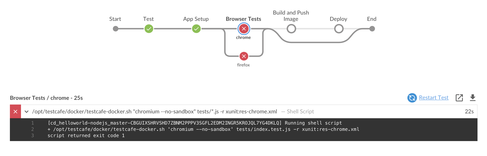  <p>The **express** framework and **pug** templating are what the majority of the dev teams use for Node.js development. So what we really want is to have a default value set, and then allow different dev teams to override that value if they are using different packages. Lucky for us, the `readProperties` step includes a parameter aptly named `defaults` that allows us to provide a map containing default key/values. We will update the `readProperties` script block with a map of default values and add the `defaults` parameter set to that map:

```
                script {
                  //define default values that may be overridden via the .nodejs-app file
                  def d = [npmPackages: 'express pug']
                  //use the Pipeline Utility Steps plugin readProperties step to read the .nodejs-app custom marker file 
                  def props = readProperties defaults: d, file: '.nodejs-app'
                  env.npmPackages = props['npmPackages']
                }
```

5. Commit the changes and then navigate to the **master** branch of your **helloworld-nodejs** job in Blue Ocean on your Team Master and run the job. The job will complete successfully using our default values for `npmPackages`. <p>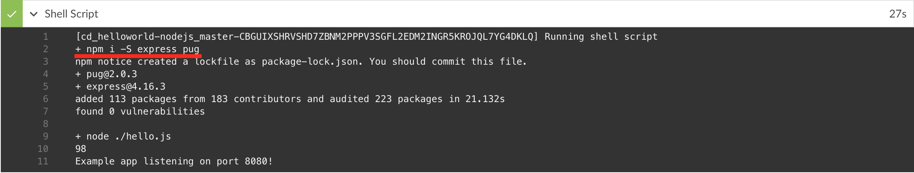

## Custom Steps with Pipeline Shared Libraries

In this exercise we are going to add a **custom step** to our Pipeline from a [**Pipeline Shared Library**](https://jenkins.io/doc/book/pipeline/shared-libraries/), providing functionality to set default values based on default Jenkins environmental variables that will provide a reusable way of using the `readProperties` step with Delcarative Pipelines and make our Pipeline script more readable.

### Pipeline Directory Structure

Shared Libraries have a very specific directory structure as follows with the focus on the `vars` directory for this exercise:

```
(root)
+- src                     # Groovy source files
|   +- org
|       +- foo
|           +- Bar.groovy  # for org.foo.Bar class
+- vars
|   +- foo.groovy          # for global 'foo' variable
|   +- foo.txt             # help for 'foo' variable
+- resources               # resource files (external libraries only)
|   +- org
|       +- foo
|           +- bar.json    # static helper data for org.foo.Bar
```

The `src` directory should look like standard Java source directory structure and will contain Java `Classes` written in `Groovy`. This directory is added to the classpath when executing Pipelines. We won't be going over using Groovy source files for Shared Libraries today, but you can find more information about them [here](https://jenkins.io/doc/book/pipeline/shared-libraries/#accessing-steps).

The `vars` directory hosts scripts that define global variables accessible from Pipeline. The basename of each `.groovy` file should be a Groovy (~ Java) identifier, conventionally `camelCased`. The matching `.txt`, if present, can contain documentation, processed through the system’s configured markup formatter (so it may really be HTML, Markdown, etc., though the `txt` extension is required).

The Groovy source files in these directories get the same “CPS transformation” as in Scripted Pipeline.

A `resources` directory allows the `libraryResource` step to be used to load associated non-Groovy files as a String value in your Pipeline script.

### Create a Custom Step

For this workshop we will only be using the simpler and more straight-forward **global variables** to define reusable Pipeline script from a Shared Library. But before we create a new **global variable** we need to decide what it needs to do. Pipeline Shared Libraries are like any other shared framework or utility - the purpose being to reduce redundant code and to adhere to [DRY](https://en.wikipedia.org/wiki/Don't_repeat_yourself) principle of software development. Also, with the advent of two different syntaxes for Pipelines - Declarative and Scripted - it is sometimes useful to use Shared Library [**custom steps**](https://jenkins.io/doc/book/pipeline/shared-libraries/#defining-custom-steps) to encapsulate Scripted syntax making Declarative Pipelines more readable. We will do just that for the `readProperties` `script` block that we added above. We will call our **custom step** `defineProps` - we can't use `readProperties` because then our new **custom step** would override and replace the `readProperties` step from the Pipeline Utilities plugin and we will actually use that step in our **custom step** as you will see below.

1. In the **master** branch of your forked **pipeline-library** repostiory navigate to the `vars` directory and open the `defineProps.groovy` with the GitHub editor. <p>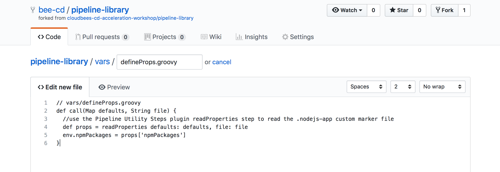
2. The file will be empty, but we will implement a `call` method as [the `call` method allows the global variable to be invoked in a manner similar to a regular Pipeline step](https://jenkins.io/doc/book/pipeline/shared-libraries/#defining-custom-steps):

```groovy
// vars/defineProps.groovy
def call(String file, Map defaults) {
  //use the Pipeline Utility Steps plugin readProperties step to read the file
  def props = readProperties defaults: defaults, file: file
  for ( e in props ) {
    env.setProperty(e.key, e.value)
  }
}
```

4. Commit the `defineProps.groovy` file. 
3. Next we will create a `defineProps.txt` file in the `vars` directory. We will format it as HTML as we are using the ***Safe HTML*** **Markup Formatter** that is configured for all the Team Masters via CJOC.  <p>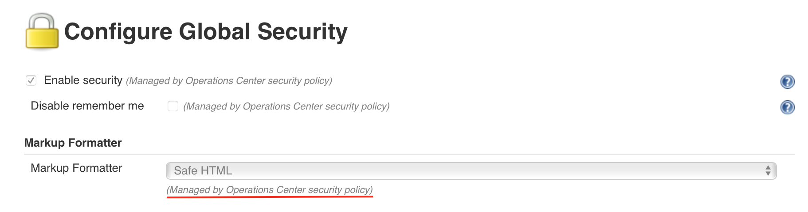<p>This will provide dynamically generated documentation on whatever Jenkins instance the Shared Library is installed for our custom step:

```html
<h2>defineProps step</h2>
<p>
A custom step for using the <pre>readProperties</pre> step from the Pipeline Utilities plugin specifically from a Declarative Pipeline. 
</p>
<h3>Configuration</h3>
<dl>
	<dt>name</dt>
	<dd><pre>String</pre><b>REQUIRED</b> the file, including path, to be read from the workspace as the properties file</dd>
	<dt>defaults</dt>
	<dd><pre>Map</pre><b>OPTIONAL</b> default values for passed in properties file</dd>
</dl>

<h3>Example:</h3>
<pre>
	defineProps('.nodejs-app', [npmPackages: 'express pug'])
</pre>
```

5. Even though we wrote it as HTML, we still have to save it with a `.txt` extension as mentioned above. Commit the `defineProps.txt` file.

>**NOTE:** Global Variable Documentation for custom steps will only be availale under a Pipeline job that uses it and has run successfully.

### Use a Custom Step

Now that the **Pipeline Shared Library** is configured for your Team Master and we have a **global variable** to use, we will use it in the `nodejs-app/Jenkinsfile.template` Pipeline script.

1. Open the GitHub editor for the **nodejs-app/Jenkinsfile.template** Pipeline script in the **master** branch of your forked **custom-marker-pipelines** repository.
2. Replace the `script` block where we are using the `readProperties` step with our new custom step - `defineProps`. Update the of the **Nodejs Setup** nested `stage` of the **Web Tests** parent `stage` to match the following:

```groovy
            stage('Nodejs Setup') {
              steps {
                checkout scm
                defineProps('.nodejs-app', [npmPackages: 'express pug'])            
                container('nodejs') {
                  sh """
                    npm i -S ${npmPackages}
                    node ./hello.js &
                  """
                }
              }   
            }
```

3. Not only have we created a reusable **custom step**, we have also made our Declartive Pipeline script much more readable. Commit the changes and then navigate to the **master** branch of your **helloworld-nodejs** job in Blue Ocean on your Team Master and run the job. The job will run successfully. Note in **Console Output** in the classic UI the checkout of the our `cd-accel` Shared Library: <p>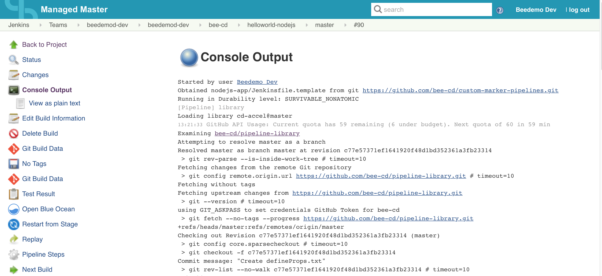
4. Exit to the class UI and click on the **Pipeline Syntax** link in the left navigation menu. Then click on the **Global Variables Reference** link and scroll to the bottom of the page. You will find the documentation that we created for our `defineProps` custom step: <p>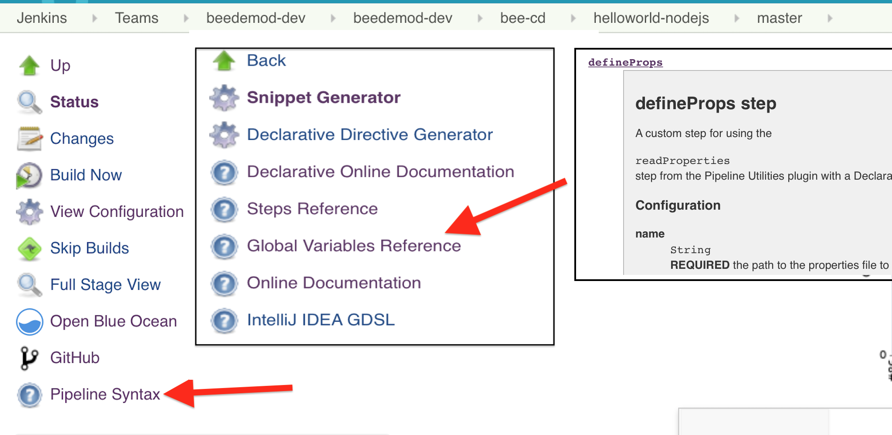

### Shared Library Steps for the 'Build and Push Image' and 'Deploy' Stages

So the **Tests** `stage` of our Pipeline executes actual **Testcafe** tests but the **Build and Push Image** and **Deploy** `stages` still don't do much. Let's change that by using some Shared Library **custom steps** that have already been created for everyone. If you open your **pipeline-library** repostiory in GitHub and switch to the `completed` branch you will notice a number of additional `groovy` files in the `vars` directory and a number of additional `resources` - including the `vars/defineProps.groovy` file and `resources/podtemplates/nodejs-app/test-pod.yml` file that we added above. 
<p>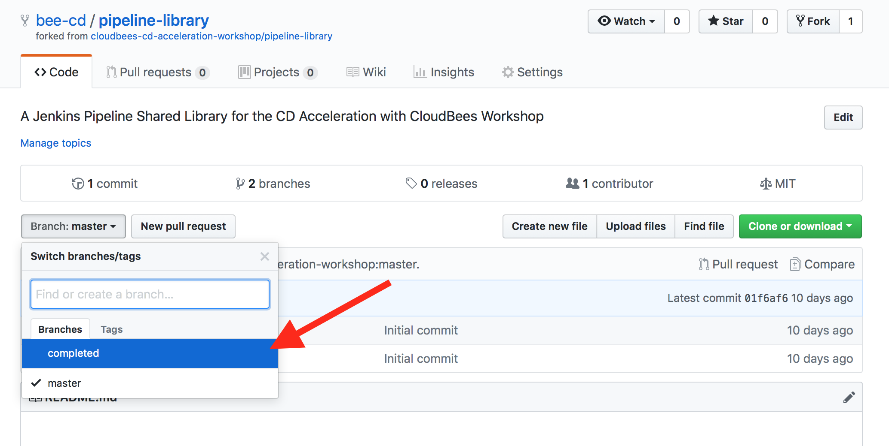 

The `completed` branch contains the following **global variables** and `resource` files:

```
(root)
+- vars
|   +- defineProps.groovy         # readProperties helper for Declarative Pipelines
|   +- defineProps.txt            # help text for 'defineProps' custom step
|   +- dockerBuildPush.groovy     # custom step for 'Build and Push Image' stage to build an image with Kaniko and pust it to an ECR
|   +- gitShortCommit.groovy      # sets an environment variable with specified length of full commmit sha - defaults to 7
|   +- imageNameTag.groovy        # custom step to dynamically provide name and tag of image based on GitHub org/repo:branch
|   +- kubeDeploy.groovy          # custom step for the 'Deploy' stage
|   +- setECRLifecyclePolicy.groovy # custom step used by the dockerBuildPush custom step to set ECR Lifecycle Policy for all pushed Docker images
+- resources                      # resource files (external libraries only)
|   +- podtemplates
|       +- awsCli.yml             # Pod Template with container that has the AWS CLI installed
|       +- dockerBuildPush.yml    # Pod Template with a tool called Kaniko - used to build and push Docker images to ECR without Docker
|       +- kubeDeploy.yml         # Pod Template with container for k8s deployments
|       +- nodejs-app
|           +- web-test-pod.yml       # k8s Pod config for **Node.js** app web testing
|           +- load-test-pod.yml      # k8s Pod config for **Node.js** app load testing
|   +- k8s
|       +- basicDeploy.yml        # k8s configuration to deploy basic apps with ingress
|   +- aws
|       +- ecr
|           +- lifecycle-policy
|               +- tempImagePolicy.json #AWS ECR Image Lifecycle Policy for all Docker images pushed to ECR
```

As you can see, there are quite a few additional **custom steps** and `resources`, and rather than take the time creating them together we are going we will use the completed versions.

#### Update Your Team Master's 'cd-accel' Shared Library

Before we can use the the additional *custom steps** and library `resources` described above we need get access to them. We could just merge the `completed` branch of your forked **pipeline-library** repository to the `master` branch. But we won't waste our time with that, as a simple update to the `library` step in your **nodejs-app/Jenkinsfile.template** Pipeline script will allow us to target a different branch. That is because when we first configured the Shared Library in our GitHub Organization project folder, we left the ***Allow default version to be overridden*** property checked - [this will allow us to override the version of the Shared Library directly in our Pipeline script](https://jenkins.io/doc/book/pipeline/shared-libraries/#library-versions).

1. Open the GitHub editor for the **nodejs-app/Jenkinsfile.template** Pipeline script in the **master** branch of your forked **custom-marker-pipelines** repository.
2. Update the `library` step to match the following:

```groovy
library 'cd-accel@completed' 
```

3. Notice that we appended `@completed` to the name of our Shared Library. It doesn't get much easier than that. Commit the changes and then navigate to the **master** branch of your **helloworld-nodejs** job in Blue Ocean on your Team Master and run the job. The job will run successfully - but the `cd-accel` Shared Library will now come from the `completed` branch as can be seen in the **Console Ouput** in the classic UI:

```
[Pipeline] library
Loading library cd-accel@completed
20:42:16 GitHub API Usage: Current quota has 53 remaining (5 under budget). Next quota of 60 in 51 min
Examining bee-cd/pipeline-library
Attempting to resolve completed as a branch
Resolved completed as branch completed at revision 7fe7310cf0f05bfa7d61164f9dc9fdbc4c381198
```

#### Update the 'Build and Push Image' Stage

We will now update the **Build and Push Image** `stage` to use the `dockerBuildPush` **custom step** described above.

1. Open the GitHub editor for the **nodejs-app/Jenkinsfile.template** Pipeline script in the **master** branch of your forked **custom-marker-pipelines** repository.
2. Replace the entire **Build and Push Imag** `stage` with the version below:

```groovy
    stage('Build and Push Image') {
      when {
        beforeAgent true
        branch 'master'
      }
      steps {
        dockerBuildPush(env.IMAGE_NAME, env.IMAGE_TAG) {
          unstash 'app'
        }
      }
      post {
        success {
          slackSend "${JOB_NAME} pipeline job is awaiting approval at: ${RUN_DISPLAY_URL}"
        }
      }
    }
```

3. Some interesting things to note are:
    1. We no longer have an `agent` defined. If you look at the `dockerBuildPush.groovy` in the `completed` branch of your **pipeline-library** repopsitory you will see that it defines a `node` which is basically a more complex version of the `agent` section and is available in both Scripted and Declarative Pipeline syntax whereas `agent` is only available in Declarative.
    2. The `unstash` step is inside of the `dockerBuildPush` step block. This is called a `closure` and [allows you to run addition, arbritary steps inside of a **custom step**](https://jenkins.io/doc/book/pipeline/shared-libraries/#defining-custom-steps).
4. Commit the changes and then navigate to the **master** branch of your **helloworld-nodejs** job in Blue Ocean on your Team Master and run the job. The job will run successfully and everyone will have a brand new Docker Image in the Amazon Elastic Container Registry we are using for this workshop. All in all, as you can see below, there is a lot more going on in the **Build and Push Image** `stage` now: <p>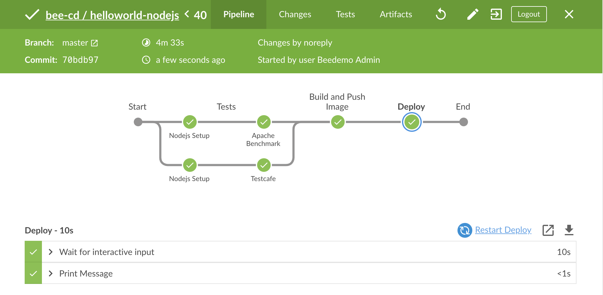

#### Update the 'Deploy' Stage

Now that we have successfully built a Docker image for our **helloworld-nodejs** app we want to deploy it. We will update the **Deploy** `stage` to use the `kubeDeploy` **custom step** described above to deploy our app to Kubernetes.

1. Open the GitHub editor for the **nodejs-app/Jenkinsfile.template** Pipeline script in the **master** branch of your forked **custom-marker-pipelines** repository.
2. Replace the entire **Deploy** `stage` with the version below:

```groovy
    stage('Deploy') {
      when {
        beforeAgent true
        branch 'master'
      }
      options {
        timeout(time: 60, unit: 'SECONDS') 
      }
      input {
        message "Should we deploy?"
        submitterParameter "APPROVER"
      }
      steps {
        kubeDeploy(env.IMAGE_NAME, env.IMAGE_TAG)
      }
    }
```

3. Commit the changes and then navigate to the **master** branch of your **helloworld-nodejs** job in Blue Ocean on your Team Master and run the job. The job will run successfully and there is a clickable link to your deployed app in the last step of the **Deploy** `stage`: <p>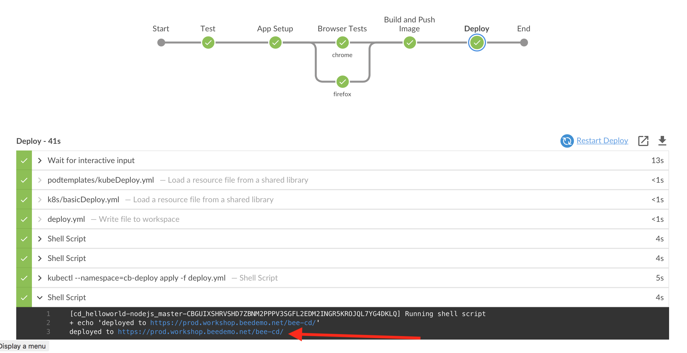<p>In your app, notice the 'Build Number' and 'Commit' id in the footer: <p>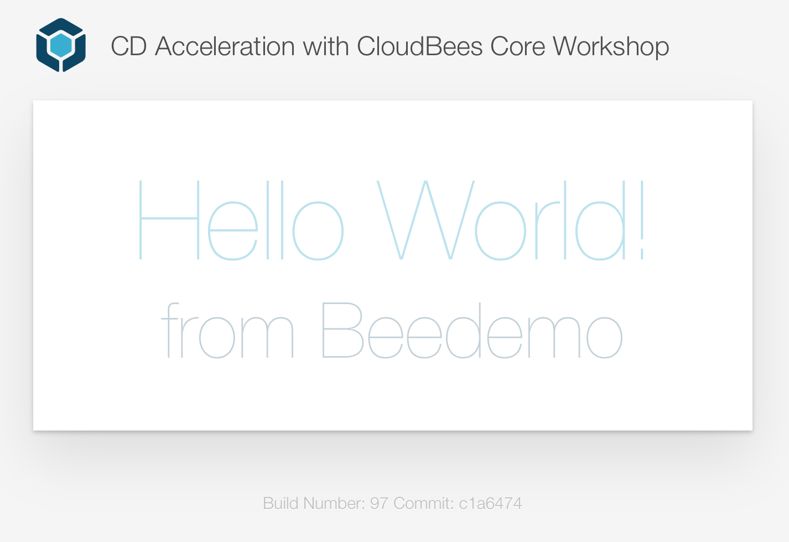

## Cross Team Collaboration
In this exercise we are going to demonstrate [CloudBee's Core Cross Team Collaboration feature](https://go.cloudbees.com/docs/cloudbees-core/cloud-admin-guide/cross-team-collaboration/).

### Cross-Team Master Events

We already have a job on the **beedemo-ops** Team Master that will publish an event. <p>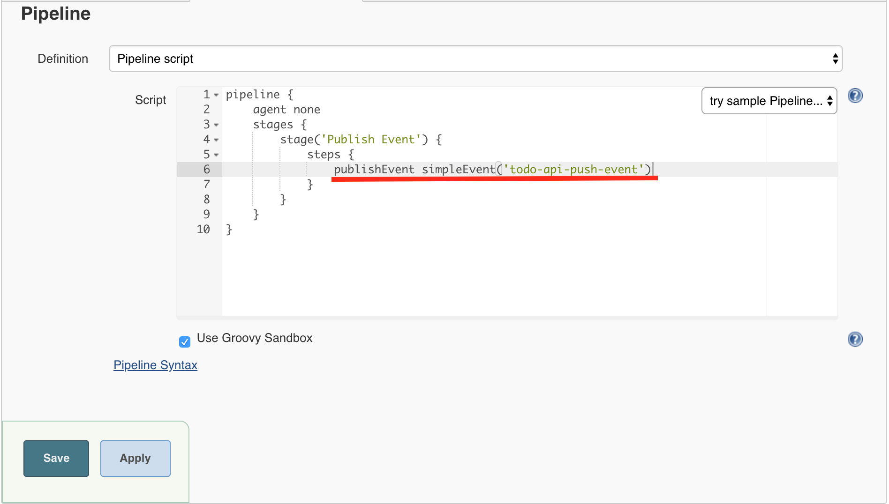

That event will be published **across Team Masters** via the CloudBees Operations Center event router. 

The Cross Team Collaboration feature has a configurable router for routing events and you will need to configure the Notification router on your Team Master before you will be able to receive the event published by the **beedemo-ops** Team Master.

1. First you need to update the **Notification Router Implementation** to use the **Operations Center Messaging** router by clicking on the **Manage Jenkins** link - on the left side at the root of your Team Master (classic ui). <p>
2. Next, scroll down and click on **Configure Notification** link. <p>
3. Check the **Enabled** checkbox and under **Notification Router Implementation** select the **Operations Center Messaging** option, and the click the **Save** button. <p>
4. Before the **hello-api** Pipeline's `hello-api-push-event` can trigger our **helloworld-nodejs** Pipeline job we must listen for the event. We do that by adding a `trigger` to our **nodejs-app/Jenkinsfile.template** Pipeline script.
5. Open the GitHub editor for the **nodejs-app/Jenkinsfile.template** Pipeline script in the **master** branch of your forked **custom-marker-pipelines** repository.
6. Add the following `trigger` block just above the top-level `stages` block:

```groovy
  triggers {
    eventTrigger simpleMatch('hello-api-push-event')
  }
```

7. Commit the changes and then navigate to the **master** branch of your **helloworld-nodejs** job in Blue Ocean on your Team Master and run the job. 

>**NOTE:**After first adding a new `trigger` you must run the job at least once so that the `trigger` is saved to the Jenkins job configuration (similar to what was necessary for the `buildDiscarder` and `preserveStashes` `options` earlier). 

<p>

8. Now I will run the **hello-api** job and everyone should see the **master** branch of their **helloworld-nodejs** job triggered. <p>
