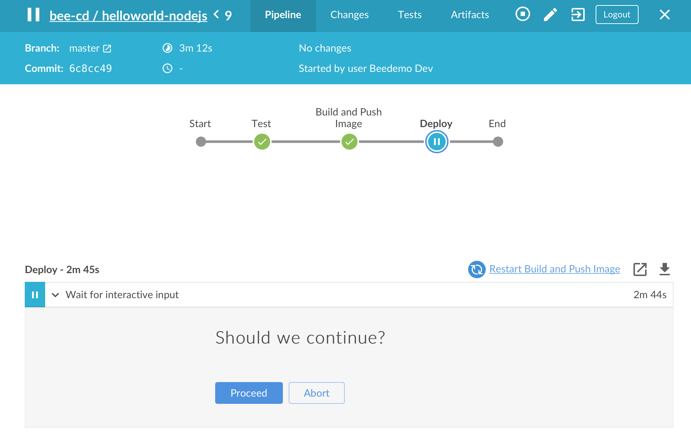
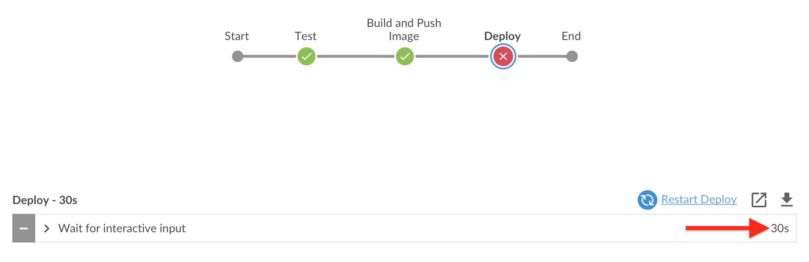
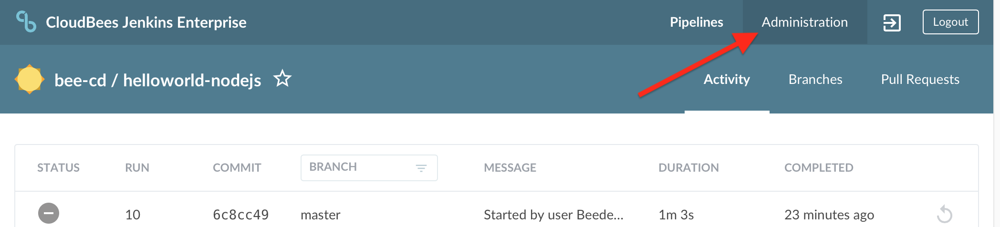
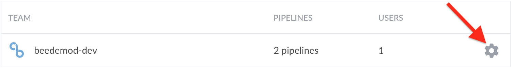
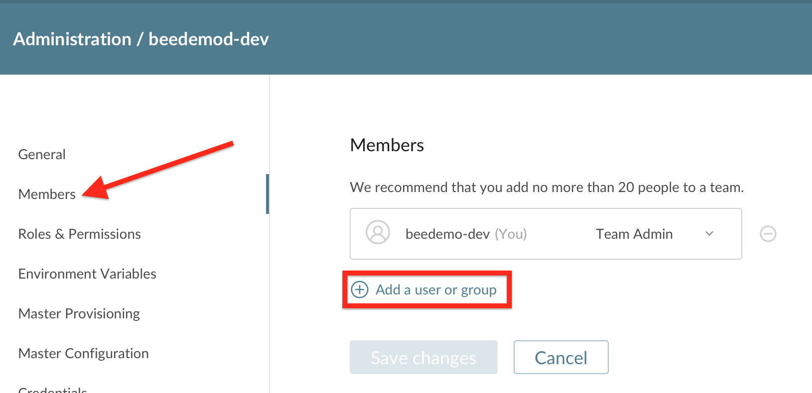
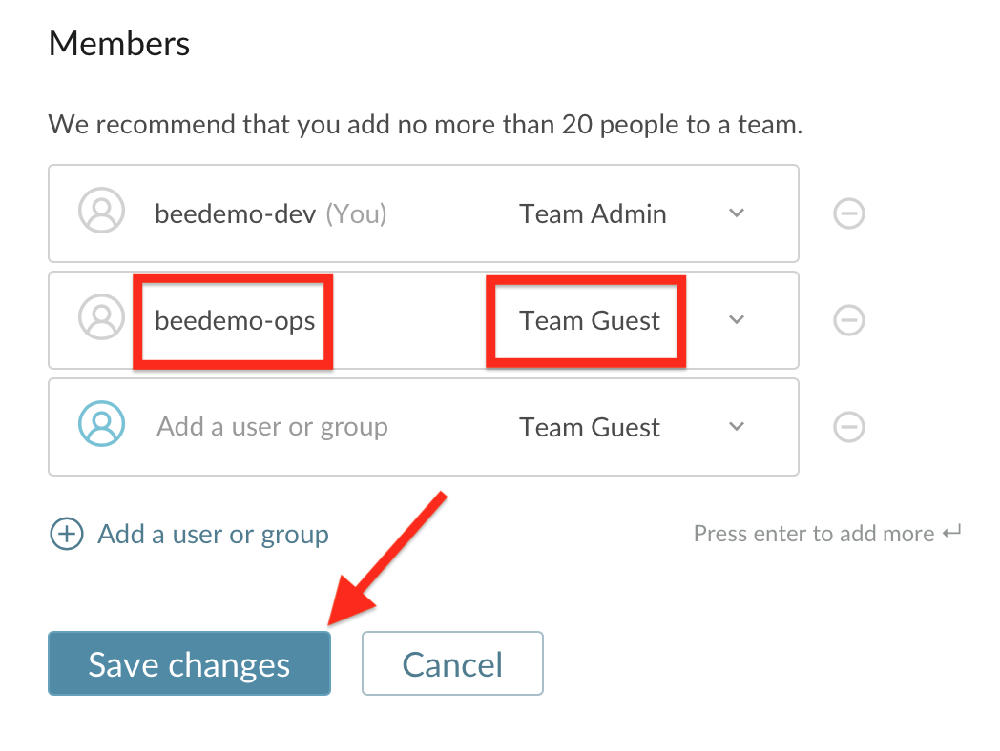
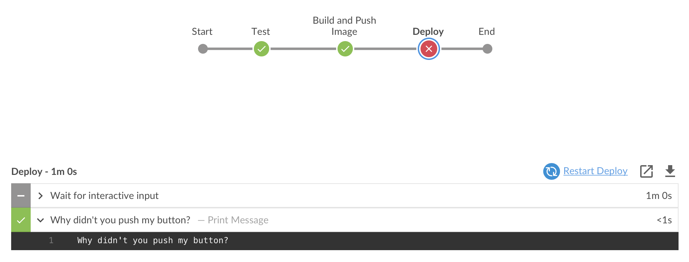

# Pipeline Approvals and Artifact Management with CloudBees Core

## Interactive Input

For this exercise we are going to add a new stage after the **Build and Push Image** stage that will demonstrate how to pause a Pipeline job and prompt for interactive input. 

>**NOTE:** The [Declarative `input` directive](https://jenkins.io/doc/book/pipeline/syntax/#input) blocks the `stage` from acquiring an agent and that is why it is configured outside the `steps` block as a directive. You could use the [pre-exsiting `input` step](https://jenkins.io/doc/pipeline/steps/pipeline-input-step/#pipeline-input-step) directly in the `steps` block but that would hold whatever `agent` is assigned to that `stage` for as long it takes for the `input` to be submitted.

1. Use the GitHub file editor to update the `nodejs-app/Jenkinsfile.template` file in your forked **custom-marker-pipelines** repository - adding the following `stage` to your Pipeline after the ***Build and Push Image*** `stage` and commit the change:

```
    stage('Deploy') {
      when {
        beforeAgent true
        branch 'master'
      }
      input {
        message "Should we continue?"
      }
      steps {
        echo "Continuing with deployment"
      }
    }
```

2. **Run** your updated Pipeline job in Blue Ocean and note the `input` prompt during the `Deploy` stage.  *This `input` prompt is also available in the Console log and classic Stage View.* <p>

3. Your Team Master will wait indefinitely for a user response to an `input` step. Let's fix that by setting a timeout. Earlier we used `options` at the global `pipeline` level to set the ***Discard old builds*** strategy for your Team Master with the `buildDiscarder` `option`. Now we will configure `options` at the `stage` level. We will add a `timeout` `option` for the **Deploy** `stage` using the [`stage` `options` directive](https://jenkins.io/doc/book/pipeline/syntax/#stage-options). Update the **Deploy** `stage` to match the following and then commit the changes:

```
    stage('Deploy') {
      when {
        beforeAgent true
        branch 'master'
      }
      options {
        timeout(time: 30, unit: 'SECONDS') 
      }
      input {
        message "Should we continue?"
      }
      steps {
        echo "Continuing with deployment"
      }
    }
```

4. **Run** your updated Pipeline job in Blue Ocean and wait at least 30 seconds once it reaches the 'Deploy' `stage`. Your pipeline will be automatically **aborted** 30 seconds after the 'Deploy' `stage` starts.<p> <p>Run it again if you would like - but this time approving it before 30 seconds expires - the job will complete successfully.

## Input Approval for Team Members

The `input` directive supports a [number of interesting configuration options](https://jenkins.io/doc/book/pipeline/syntax/#configuration-options). In this exercise we are going to use the `submitter` option to control what Team Master member is allowed to submit the `input` directive. But first you need to add another member to your CloudBees Team Master. Team Masters provide an easy to use authorization model right out-of-the-box. The following roles are available ([there is a CLI to add or modify roles](https://go.cloudbees.com/docs/cloudbees-core/cloud-admin-guide/cje-ux/#_team_roles)):

- **Team Admin:** administrator of the Team Master.
- **Team Member:** read, write and execute permission on the pipelines.
- **Team Guest:** read only.

We want to add a **Team Guest** to our Team Masters and then set that Team member as the `submitter` for our `input` directive. Before you begin, pick a person near you to pair up with. The two of you will share each other's Jenkins account names. You will use that account name when adding a new member to your Team Master below:

1. On your Team Master, navigate to the Team list by clicking on the ***Administration*** link on the top right (this link is available on all Blue Ocean pages accept for the [Pipeline Run Details view](https://jenkins.io/doc/book/blueocean/pipeline-run-details/#pipeline-run-details-view)). <p>
2. Next, click on the cog icon for your team.  <p>
3. Click on the ***Members*** link in the left menu and then click on the ***Add a user or group*** link. <p>
4. Select **Team Guest** from the role drop-down, enter the account name for the person next to you in the ***Add user or group*** input (I will use **beedemo-ops**), press your ***enter/return*** key, and then click the **Save changes** button.  <p>
5. Click on the ***Pipelines*** link in the top menu.

Now that we all have a new team member, you can add them as a `submitter` for the `input` directive in your `nodejs-app/Jenkinsfile.template` Pipeline script.

1. Use the GitHub file editor to update your `nodejs-app/Jenkinsfile.template` Pipeline script in your forked **custom-marker-pipelines** repository - updating the `input` directive of the **Deploy** `stage` with the following changes (replacing **beedemo-ops** with Jenkins username of your new **Team Guest** member). Also, update the `timeout` duration to give your approver plenty of time to submit the `input`:

```
      options {
        timeout(time: 60, unit: 'SECONDS') 
      }
      input {
        message "Should we deploy?"
        submitter "beedemo-ops"
        submitterParameter "APPROVER"
      }
```

2. So, we added one additonal configuration option for our `input` directive: `submitterParameter`. Setting the  `submitterParameter` option will result in a Pipeline environmental variable named `APPROVER` being set with the value being the username of the user that submitted the `input`. In the example above it will either be **beedemo-ops**. Update the `steps` section so the `echo` step in your `nodejs-app/Jenkinsfile.template` Pipeline script will print the `APPROVER` environmental variable and then commit the changes:

```
      steps {
        echo "Continuing with deployment - approved by ${APPROVER}"
      }
```

3. Navigate to the **master** branch of your **helloworld-nodejs** job in Blue Ocean on your Team Master and run the job. If you attempt to approve the `input` you will get an error: <p>
4. The ***submitter*** needs to navigate to the **master** branch of your **helloworld-nodejs** job on your Team Master to approve the `input` of your **helloworld-nodejs** Pipeline. You can use the *Team switcher* to quickly navigate to another Team Master that you are a member. The *Team switcher* drop-down will appear in the top right of your screen once you have been added as a member to another Team Master. The ***submitter*** needs to switch to the Team where they are a *Team Guest* member by selecting that team from the *Team switcher* drop-down. <p>
5. As the ***submitter*** navigate to the **helloworld-nodejs** job on your new team and approve the `input`. Note the output of the `echo` step. <p>

>**NOTE:** If you select a Pipeline job as a *favorite* you will be able to see things like jobs awaiting `input` submission in the Blue Ocean **Dashboard**. 

<p>

## Post Actions

What happens if your `input` step times out or if the *approver* clicks the **Abort** button? There is a special [`post` section for Delcarative Pipelines](https://jenkins.io/doc/book/pipeline/syntax/#post) that allows you to define one or more additional steps that are run upon the completion of the entire `pipeline` or an individual `stage` execution and are designed to [handle a variety of conditions](https://jenkins.io/doc/book/pipeline/syntax/#post-conditions) (not only **aborted**) that could occur outside the standard Pipeline flow.

In this example we will add a `post` section to our **Deploy** stage to handle a timeout or disapproval by our submitter (aborted run). 

1. Add the following `post` section just below the `options` directive a the root of your Pipeline using the GitHub editor and commit your changes:

```
pipeline {
  agent { label 'nodejs-app' }
  options { 
    buildDiscarder(logRotator(numToKeepStr: '2'))
  }
  post {
    aborted {
      echo "Why didn't you push my button?"
    }
  }
```

3. Run your pipeline from the **Branches** view of the Blue Ocean Activity View for your pipeline.
4. Let the job timeout or have your `submitter` click the **Abort** button. You will see the following output: <p>
5. In order to speed up the rest of the workshop, remove the the `submitter` option for the `input` directive by editing the `nodejs-app/Jenkinsfile.template` file in your forked **custom-marker-pipelines** repository and then commit the changes. Your **Deploy** `stage` should match the following and you will now be able to approve your own job:

```
    stage('Deploy') {
      when {
        beforeAgent true
        branch 'master'
      }
      options {
        timeout(time: 60, unit: 'SECONDS') 
      }
      input {
        message "Should we deploy?"
        submitterParameter "APPROVER"
      }
      steps {
        echo "Continuing with deployment - approved by ${APPROVER}"
      }
    }
```

### Skip Default Checkout

By default, when a global `agent` - that is an `agent` at the `pipeline` level - is used and there aren't any agents defined at the individual `stage` levels, then that same `agent` is shared across all the `stages` and the automatic source code checkout only happens once. But you will typically want to use different agents for different stages. And sometimes you don't need to checkout the source code in every `stage`. That is the case for our Pipeline for the **helloworld-nodejs** repository - we will eventually have different Kubernetes Pod Template based agents for each `stage`. So we are going to revisit the automatic code checkout for Declarative Pipelines that was mentioned in the [Basic Declarative Syntax Structure](./intro-pipeline-cb-core.md#basic-declarative-syntax-structure) lesson. Declarative Pipeline checks out source code by default as part of the `agent` directive. However, we don't need all of the files in the **helloworld-nodejs** repository in all of the stages. The `skipDefaultCheckout` option is a global level `options` to disable automatic checkouts.

1. First, update the global `options` directive by adding the `skipDefaultCheckout` job setting:

```
pipeline {
  agent none
  options { 
    buildDiscarder(logRotator(numToKeepStr: '2'))
    skipDefaultCheckout true
  }
```

2. Next, we need to add a checkout step - `checkout scm` to the **Test** stage, we don't want to do a full checkout in any of the other stages but we do need a checkout in this `stage`:

```
    stage('Test') {
      agent { label 'nodejs-app' }
      steps {
        checkout scm
        container('nodejs') {
          echo 'Hello World!'   
          sh 'node --version'
        }
      }
    }
```

3. Navigate to the **master** branch of your **helloworld-nodejs** job in Blue Ocean on your Team Master and run the job.

>**NOTE:** The `scm` part of the [`checkout scm` step](https://jenkins.io/doc/pipeline/steps/workflow-scm-step/#code-checkout-code-general-scm) is a special variable that is created for all Pipelines configured to load their Pipeline script from source control such as our **helloworld-nodejs** Multibranch Pipeline project.

## Stash and Unstash

Sometimes you may need to share certain files between `stages` of a `pipeline` but not actually need to archive those files for use once the job run has completed. That is precisely the purpose of the [`stash`](https://jenkins.io/doc/pipeline/steps/workflow-basic-steps/#stash-stash-some-files-to-be-used-later-in-the-build) and [`unstash`](https://jenkins.io/doc/pipeline/steps/workflow-basic-steps/#unstash-restore-files-previously-stashed) steps. We are eventually going to need certain files from **helloworld-nodejs** in the **Build and Push Image** `stage` - but we won't need all of the checked out files - like the **test** files. So we will `stash` only the files checked out in the **Test** `stage` that we will need for the the **Build and Push Image** `stage`.

1. Add the following `post` section just below the `steps` section of the **Test** `stage` using the GitHub editor and commit your changes:

```
      post {
        success {
          stash name: 'app', includes: '*.js, public/**, views/*, Dockerfile'
        }
      }
```

2. Remember, `post` sections are available at both the global `pipeline` level and at the individual `stage` level. The reason we added it to the `success` condition of the `post` section is because we only need the `stash` of files if we successfully get past the **Test** `stage`. Now we will add the `unstash` step to the **Build and Push Image** `stage`.

```
    stage('Build and Push Image') {
      agent any
      when {
        beforeAgent true
        branch 'master'
      }
      steps {
        echo "TODO - build and push image"
        unstash 'app'
      }
    }
```

4. Also note that we added `agent any` to the **Build and Push Image** `stage` because the `unstash` step requires a heavyweight executor as discussed in the [**Stage Specific Agents and Agent None**](exercises/intro-pipeline-cb-core.md#stage-specific-agents-and-agent-none) lesson - it won't execute successfully on the **fly-weight** executor of the Jenkins master. Next, navigate to the **master** branch of your **helloworld-nodejs** job in Blue Ocean on your Team Master and run the job. You will see files being `stashed` and then `unstashed`.

```
Stashed 4 file(s) to https://cd-accel.s3.amazonaws.com/cb-core/artifacts/beedemod-dev/bee-cd/helloworld-nodejs/master/28/stashes/app.tgz
...
Unstashed file(s) from https://cd-accel.s3.amazonaws.com/cb-core/artifacts/beedemod-dev/bee-cd/helloworld-nodejs/master/28/stashes/app.tgz
```

>**NOTE:** Typically `stash` files are copied from the `agent` to the Jenkins master and `unstash` files are copied from the Jenkins master back to the agent. This results in quite a bit of network IO between the Jenkins master(s) and agents, and has been a source of numerous performance issues with CloudBees customs. So CloudBees developed an AWS S3 based implementation of the [**ArtifactManagerFactory**](https://jenkins.io/doc/developer/extensions/jenkins-core/#artifactmanagerfactory) extension that was added to Jenkins core as of the 2.118 release. The CloudBees developed [Artifact Manager on S3 plugin](https://github.com/jenkinsci/artifact-manager-s3-plugin) integrates transparently with the `archive`/`unarchive` and `stash`/`unstash` Pipeline steps to store those files in an AWS S3 Bucket - with the upload and download happening on the `agent` without any overhead for the Jenkins master. And because of the modern, container based architecture of CloudBees Core on Kubernetes - we were able to [easily add the necessarry plugins and configuration to the custom Team Master Docker image being used by everyone with CasC](https://github.com/kypseli/cb-core-mm/blob/kube-workshop/config-as-code.yml#L16). This made it super easy to provide this awesome cloud native artifact storage for everyones' Team Master - as soon as they were provisioned.

 <p>

## Restartable Stages

Declarative Pipelines support a feature referred to as [***Restartable Stages***](https://jenkins.io/doc/book/pipeline/running-pipelines/#restart-from-a-stage). You can restart any completed Declarative Pipeline from any top-level `stage` which ran in that Pipeline job run. This allows you to re-run a Pipeline from a `stage` which may have failed due to transient or environmental reasons. All inputs to the Pipeline will be the same. This includes SCM information, build parameters, and the contents of any `stash` step calls in the original Pipeline, if specified. Stages which were skipped due to an earlier failure will not be available to be restarted, but `stages` which were skipped due to a `when` condition not being satisfied will be available.

1. Navigate to the **master** branch of your **helloworld-nodejs** job in Blue Ocean on your Team Master.
2. Select the **Build and Push Image** `stage` if it isn't already selected and then click on the ***Restart Build and Push Image*** link. <p>
3. The **Test** `stage` will be skipped, but the job will fail with the following error: <p>
4. So what is going on? By default, a `stash` is removed when a Pipeline job completes, regardless of the result of the Pipeline. But in this case we want to **restart** from a `stage` where we `unstash` files. Declarative Pipeline has the ability to **preserve** a `stash` across job runs for this exact reason - but you must declare it by adding the `preserveStashes` job property to the `pipeline` global `options`. Update the global `options` section of your **nodejs-app/Jenkinsfile.template** Pipeline script:

```
  options { 
    buildDiscarder(logRotator(numToKeepStr: '2'))
    skipDefaultCheckout true
    preserveStashes(buildCount: 2)
  }
```

5. By default, the `preserveStashes` step will only preserver 1 run, but provides the `buildCount` parameter to set a range from 1 to 50 runs to preserve. We will preserve 2 runs to match the `buildDiscarder` policy we have in place. 
6. Next, navigate to the **master** branch of your **helloworld-nodejs** job in Blue Ocean on your Team Master and run the job from the start. This is necessary for the `preserveStash` to take effect and for the `stash` in the **Test** `stage` to get preserved. 
7. Once the job has completed, select the **Build and Push Image** `stage` and then click on the ***Restart Build and Push Image*** link. The `unstash` step in the **Build and Push Image** `stage` will work now and the job will complete successfully. <p>

## Next Lesson

Before moving on to the next lesson you can make sure that your **nodejs-app/Jenkinsfile.template** Pipeline script is correct by comparing to or copying from the **after-approvals** branch of your forked **custom-marker-pipelines** repository.

You may proceed to the next set of exercises - **[Parallel and Sequential Stages with CloudBees Core](./parallel-sequential-cb-core.md)** - when your instructor tells you.
