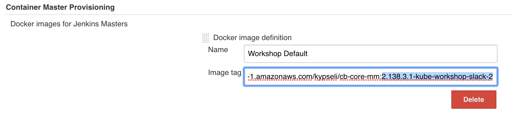
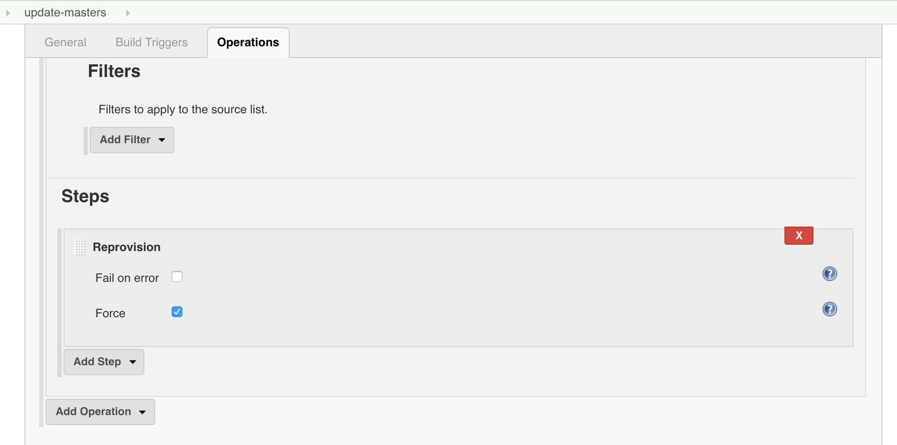
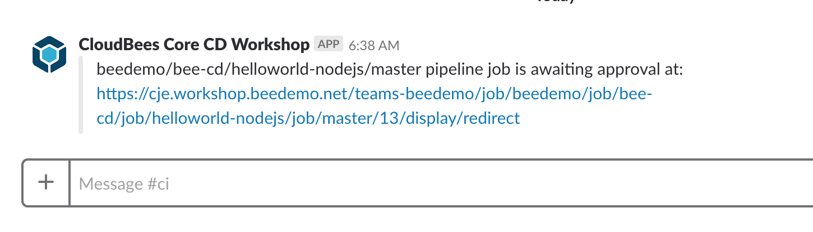

# Pipeline Approvals, Post Actions and Notifications with CloudBees Core

In this set of exercises, we will see how you can capture interactive input to your Jenkins Pipeline while it is running, get an introduction to the Declarative [`post` sections](https://jenkins.io/doc/book/pipeline/syntax/#post) and use a **post-condition** block to send a notification. We will also see how CloudBees Core enables [easy simultaneous updates of all of our Team Masters](https://go.cloudbees.com/docs/cloudbees-core/cloud-admin-guide/operating/#_bulk_upgrading_managed_masters) and will use this capability to add the Slack plugin and necessary configuration to send a Slack notification from our Pipeline job.

## Interactive Input

For this exercise we are going to add a new stage after the **Build and Push Image** stage that will demonstrate how to pause a Pipeline job and prompt for interactive input. 

>**NOTE:** The [Declarative `input` directive](https://jenkins.io/doc/book/pipeline/syntax/#input) blocks the `stage` from acquiring an agent and that is why it is configured outside the `steps` block as a directive. You could use the [pre-exsiting `input` step](https://jenkins.io/doc/pipeline/steps/pipeline-input-step/#pipeline-input-step) directly in the `steps` block but that would hold whatever `agent` is assigned to that `stage` for as long it takes for the `input` to be submitted.

1. Use the GitHub file editor to update the `nodejs-app/Jenkinsfile.template` file in your forked **custom-marker-pipelines** repository - adding the following `stage` to your Pipeline after the ***Build and Push Image*** `stage` and commit the change:

```
    stage('Deploy') {
      when {
        beforeAgent true
        branch 'master'
      }
      input {
        message "Should we continue?"
      }
      steps {
        echo "Continuing with deployment"
      }
    }
```

2. **Run** your updated Pipeline job in Blue Ocean and note the `input` prompt during the `Deploy` stage.  *This `input` prompt is also available in the Console log and classic Stage View.* <p>

3. Your Team Master will wait indefinitely for a user response to an `input` step. Let's fix that by setting a timeout. Earlier we used `options` at the global `pipeline` level to set the ***Discard old builds*** strategy for your Team Master with the `buildDiscarder` `option`. Now we will configure `options` at the `stage` level. We will add a `timeout` `option` for the **Deploy** `stage` using the [`stage` `options` directive](https://jenkins.io/doc/book/pipeline/syntax/#stage-options). Update the **Deploy** `stage` to match the following and then commit the changes:

```
    stage('Deploy') {
      when {
        beforeAgent true
        branch 'master'
      }
      options {
        timeout(time: 30, unit: 'SECONDS') 
      }
      input {
        message "Should we continue?"
      }
      steps {
        echo "Continuing with deployment"
      }
    }
```

4. **Run** your updated Pipeline job in Blue Ocean and wait at least 30 seconds once it reaches the 'Deploy' `stage`. Your pipeline will be automatically **aborted** 30 seconds after the 'Deploy' `stage` starts.<p> <p>Run it again if you would like - but this time approving it before 30 seconds expires - the job will complete successfully.

## Input Approval for Team Members

The `input` directive supports a [number of interesting configuration options](https://jenkins.io/doc/book/pipeline/syntax/#configuration-options). In this exercise we are going to use the `submitter` option to control what Team Master member is allowed to submit the `input` directive. But first you need to add another member to your CloudBees Team Master. Team Masters provide an easy to use authorization model right out-of-the-box. The following roles are available ([there is a CLI to add or modify roles](https://go.cloudbees.com/docs/cloudbees-core/cloud-admin-guide/cje-ux/#_team_roles)):

- **Team Admin:** administrator of the Team Master.
- **Team Member:** read, write and execute permission on the pipelines.
- **Team Guest:** read only.

We want to add a **Team Guest** to our Team Masters and then set that Team member as the `submitter` for our `input` directive. Before you begin, pick a person near you to pair up with. The two of you will share each other's Jenkins account names. You will use that account name when adding a new member to your Team Master below:

1. On your Team Master, navigate to the Team list by clicking on the ***Administration*** link on the top right (this link is available on all Blue Ocean pages accept for the [Pipeline Run Details view](https://jenkins.io/doc/book/blueocean/pipeline-run-details/#pipeline-run-details-view)). <p>
2. Next, click on the cog icon for your team.  <p>
3. Click on the ***Members*** link in the left menu and then click on the ***Add a user or group*** link. <p>
4. Select **Team Guest** from the role drop-down, enter the account name for the person next to you in the ***Add user or group*** input (I will use **beedemo-ops**), press your ***enter/return*** key, and then click the **Save changes** button.  <p>
5. Click on the ***Pipelines*** link in the top menu.

Now that we all have a new team member, you can add them as a `submitter` for the `input` directive in your `nodejs-app/Jenkinsfile.template` Pipeline script.

1. Use the GitHub file editor to update your `nodejs-app/Jenkinsfile.template` Pipeline script in your forked **custom-marker-pipelines** repository - updating the `input` directive of the **Deploy** `stage` with the following changes (replacing **beedemo-ops** with Jenkins username of your new **Team Guest** member). Also, update the `timeout` duration to give your approver plenty of time to submit the `input`:

```
      options {
        timeout(time: 60, unit: 'SECONDS') 
      }
      input {
        message "Should we deploy?"
        submitter "beedemo-ops"
        submitterParameter "APPROVER"
      }
```

2. So, we added one additonal configuration option for our `input` directive: `submitterParameter`. Setting the  `submitterParameter` option will result in a Pipeline environmental variable named `APPROVER` being set with the value being the username of the user that submitted the `input`. In the example above it will either be **beedemo-ops**. Update the `steps` section so the `echo` step in your `nodejs-app/Jenkinsfile.template` Pipeline script will print the `APPROVER` environmental variable and then commit the changes:

```
      steps {
        echo "Continuing with deployment - approved by ${APPROVER}"
      }
```

3. Navigate to the **master** branch of your **helloworld-nodejs** job in Blue Ocean on your Team Master and run the job. If you attempt to approve the `input` you will get an error: <p>
4. The ***submitter*** needs to navigate to the **master** branch of your **helloworld-nodejs** job on your Team Master to approve the `input` of your **helloworld-nodejs** Pipeline. You can use the *Team switcher* to quickly navigate to another Team Master that you are a member. The *Team switcher* drop-down will appear in the top right of your screen once you have been added as a member to another Team Master. The ***submitter*** needs to switch to the Team where they are a *Team Guest* member by selecting that team from the *Team switcher* drop-down. <p>
5. As the ***submitter*** navigate to the **helloworld-nodejs** job on your new team and approve the `input`. Note the output of the `echo` step. <p>

>**NOTE:** If you select a Pipeline job as a *favorite* you will be able to see things like jobs awaiting `input` submission in the Blue Ocean **Dashboard**. 

<p>

## Declarative Post Section

What happens if your `input` step times out or if the *approver* clicks the **Abort** button? There is a special [`post` section for Delcarative Pipelines](https://jenkins.io/doc/book/pipeline/syntax/#post) that allows you to define one or more additional steps that are run upon the completion of the entire `pipeline` or an individual `stage` execution and are designed to [handle a variety of conditions](https://jenkins.io/doc/book/pipeline/syntax/#post-conditions) (not only **aborted**) that could occur outside the standard Pipeline flow.

In this example we will add a `post` section to our **Deploy** stage to handle a timeout or disapproval by our submitter (aborted run). 

1. Add the following `post` section just below the `options` directive a the root of your Pipeline using the GitHub editor and commit your changes:

```
pipeline {
  agent { label 'nodejs-app' }
  options { 
    buildDiscarder(logRotator(numToKeepStr: '2'))
  }
  post {
    aborted {
      echo "Why didn't you push my button?"
    }
  }
```

>**NOTE:** Even though we are putting the `post` section near the top of our Pipeline it will still run after all the `stages` are complete.

3. Run your pipeline from the **Branches** view of the Blue Ocean Activity View for your pipeline.
4. Let the job timeout or have your `submitter` click the **Abort** button. You will see the following output: <p>
5. In order to speed up the rest of the workshop, remove the the `submitter` option for the `input` directive by editing the `nodejs-app/Jenkinsfile.template` file in your forked **custom-marker-pipelines** repository and then commit the changes. Your **Deploy** `stage` should match the following and you will now be able to approve your own job:

```
    stage('Deploy') {
      when {
        beforeAgent true
        branch 'master'
      }
      options {
        timeout(time: 60, unit: 'SECONDS') 
      }
      input {
        message "Should we deploy?"
        submitterParameter "APPROVER"
      }
      steps {
        echo "Continuing with deployment - approved by ${APPROVER}"
      }
    }
```

### Skip Default Checkout

By default, when a global `agent` - that is an `agent` at the `pipeline` level - is used and there aren't any agents defined at the individual `stage` levels, then that same `agent` is shared across all the `stages` and the automatic source code checkout only happens once. But you will typically want to use different **agents** for different **stages**. And sometimes you don't need to checkout the source code in every `stage`. That is the case for our Pipeline for the **helloworld-nodejs** repository - we will eventually have different Kubernetes Pod Template based agents for each `stage`. So we are going to revisit the automatic code checkout for Declarative Pipelines that was mentioned in the [Basic Declarative Syntax Structure](./intro-pipeline-cb-core.md#basic-declarative-syntax-structure) lesson. Declarative Pipeline checks out source code by default as part of the `agent` directive. However, we don't need all of the files in the **helloworld-nodejs** repository in all of the stages. The `skipDefaultCheckout` option is a global level `options` to disable automatic checkouts.

1. First, update the global `options` directive by adding the `skipDefaultCheckout` job setting:

```
pipeline {
  agent none
  options { 
    buildDiscarder(logRotator(numToKeepStr: '2'))
    skipDefaultCheckout true
  }
```

2. Next, we need to add a checkout step - `checkout scm` to the **Test** stage, we don't want to do a full checkout in any of the other stages but we do need a checkout in this `stage`:

```
    stage('Test') {
      agent { label 'nodejs-app' }
      steps {
        checkout scm
        container('nodejs') {
          echo 'Hello World!'   
          sh 'node --version'
        }
      }
    }
```

3. Navigate to the **master** branch of your **helloworld-nodejs** job in Blue Ocean on your Team Master and run the job.

>**NOTE:** The `scm` part of the [`checkout scm` step](https://jenkins.io/doc/pipeline/steps/workflow-scm-step/#code-checkout-code-general-scm) is a special variable that is created for all Pipelines configured to load their Pipeline script from source control such as our **helloworld-nodejs** Multibranch Pipeline project.

## Send Notification
Typically if you are using the `input` step with your Jenkins Pipeline you will want to send out a notification to the targeted approvers before the `input` step pauses the job. In this exercise we will send a notification using the Slack plugin's `slackSend` step. But before that, we must update everyone's **Team Master** by installing and configuring the Slack plugin. Rather than have everyone do that manually on their own, we will take advantage of the CloudBees Core Operations Center [Cluster Operations to *bulk* upgrade everyone's **Team Master**](https://go.cloudbees.com/docs/cloudbees-core/cloud-admin-guide/operating/#_bulk_upgrading_managed_masters).

### Bulk-upgrading Team Masters
For the first part of this exercise everyone will just follow along as it is the Operations Center administrator that would perform this task for all the Teams across your organization. Most of the tasks required to complete this task have already been done, but we will review all of the components of the bulk-upgrade to enable Slack notifications across all **Team Masters**.

1. For this workshop we have created a [custom container (Docker) image for our Team Masters](https://github.com/kypseli/cb-core-mm/blob/kube-workshop/Dockerfile). Among other things, this custom image allows us to manage the automatic installation of additional plugins. So the first thing we will need to do is add the **Slack** plugin to this custom image and to do that, all we have to do is add it to the `plugin.txt` file which will utilize the [`plugin.sh` script](https://github.com/kypseli/cb-core-mm/blob/kube-workshop-slack/plugins.sh) to install every plugin in the list and their dependencies:

```
configuration-as-code:1.2
configuration-as-code-support:1.2
notification-api:1.1
operations-center-notification:1.0
aws-credentials:1.23
artifact-manager-s3:1.1
aws-global-configuration:1.0
devoptics:1.1494
slack:2.4
```

>**NOTE:** The 2.4 version of the Slack plugin is not yet released and we are actually using a **SNAPSHOT** release. To use the **SNAPSHOT** version, we downloaded the **SNAPSHOT** build from the Jenkins CI server and added it to the [`plugins` directory](https://github.com/kypseli/cb-core-mm/tree/kube-workshop-slack/plugins) of our custom container image, thhe plugins in that directory are in turn copied to the `/usr/share/jenkins/ref/plugins/` directory of each **Team Master** Jenkins home from which it is automatically installed - with this approach, plugin dependencies must be managed manually. Once the 2.4 version is released we will be able to utilize the method above.

2. Next we want to add the necessary **configuration** for the Slack plugin so that every Team can start using it right away. Fot that, we turn to the [Jenkins **C**onfiguration **as** **C**ode plugin](https://github.com/jenkinsci/configuration-as-code-plugin). The **CasC** plugin allows us to define configuration for all the **Team Masters** in a [simple yaml file](https://github.com/kypseli/cb-core-mm/blob/kube-workshop-slack/config-as-code.yml) that we [copy into the custom container image](https://github.com/kypseli/cb-core-mm/blob/kube-workshop-slack/Dockerfile#L20). Here is the configuration snippet for the Slack plugin:

```
  slackNotifier:
    teamDomain: beedemo-team
    tokenCredentialId: beedemo-slack
    room: "#ci"
```

3. After those changes are made for our custom container image we need to build the image and push it to container registry. We, of course, have already done that and the image has been pushed to an AWS Elastic Container Registry (ECR) as `946759952272.dkr.ecr.us-east-1.amazonaws.com/kypseli/cb-core-mm:2.138.2.2-kube-workshop-slack-1`.
4. Next, we need to update what Docker Image is the default for our **Team Masters** on Operations Center:<p>
5. Now all we have to do is run a Cluster Operation job on CloudBees Core Operations Center that has been configured to *reprovision* all of the **Team Masters** resulting in each **Team Master** using the new container image. Once your **Team Master** has been restarted the Slack plugin will be installed and cofigured:<p>

### Send a Slack Notification

Now all you have to do is add the `slackSend` step to the `success` `post` block of the **Build and Push Image** `stage`.

1. Use the GitHub file editor to update your `nodejs-app/Jenkinsfile.template` Pipeline script in your forked **custom-marker-pipelines** repository and add the following `post` block after the `steps` block of the **Build and Push Image** `stage` and then commit the changes:

```
    stage('Build and Push Image') {
      agent any
      when {
        beforeAgent true
        branch 'master'
      }
      steps {
        echo "TODO - build and push image"
        unstash 'app'
      }
      post {
        success {
          slackSend "${JOB_NAME} pipeline job is awaiting approval at: ${RUN_DISPLAY_URL}"
        }
      }
    }
```

2. Navigate to the **master** branch of your **helloworld-nodejs** job in Blue Ocean on your Team Master and run the job. 
3. After your Pipeline job completes the `steps` in the **Build and Push Image** `stage` a message from your **Team Master** in the beedemo-team #ci Slack channel as below:<p>

## Next Lesson

Before moving on to the next lesson you can make sure that your **nodejs-app/Jenkinsfile.template** Pipeline script is correct by comparing to or copying from the **after-approvals** branch of your forked **custom-marker-pipelines** repository.

You may proceed to the next set of exercises - **[Pipeline Artifacts and Restartable, Parallel and Sequential Stages with CloudBees Core](./artifacts-parallel-sequential-cb-core.md)** - when your instructor tells you.
