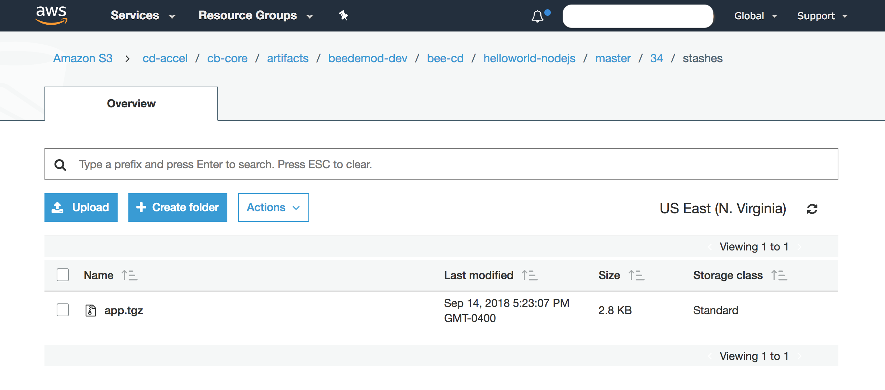
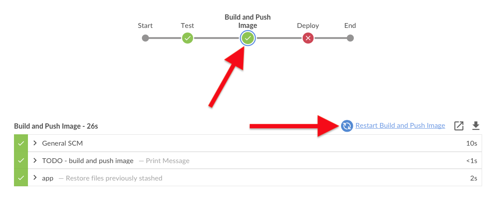
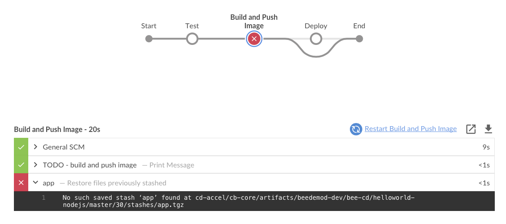
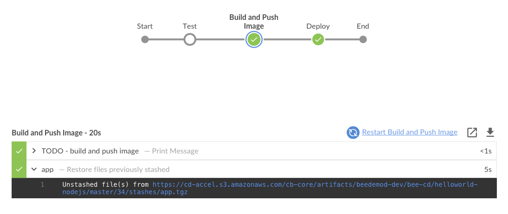
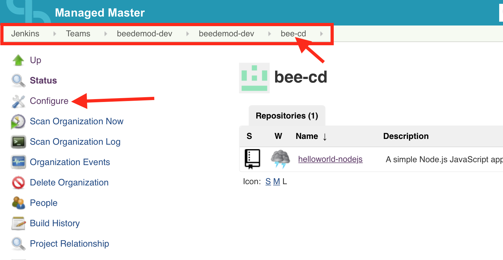
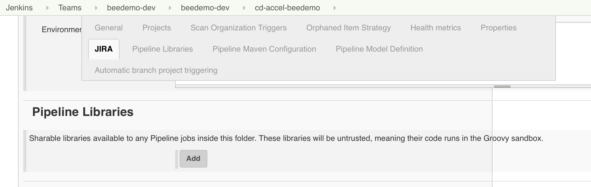
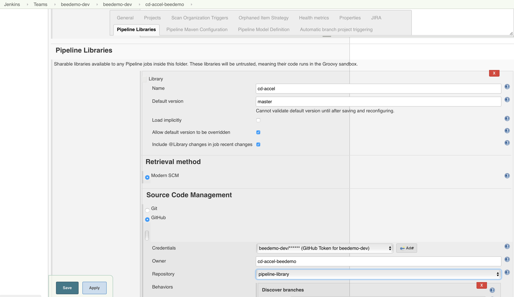
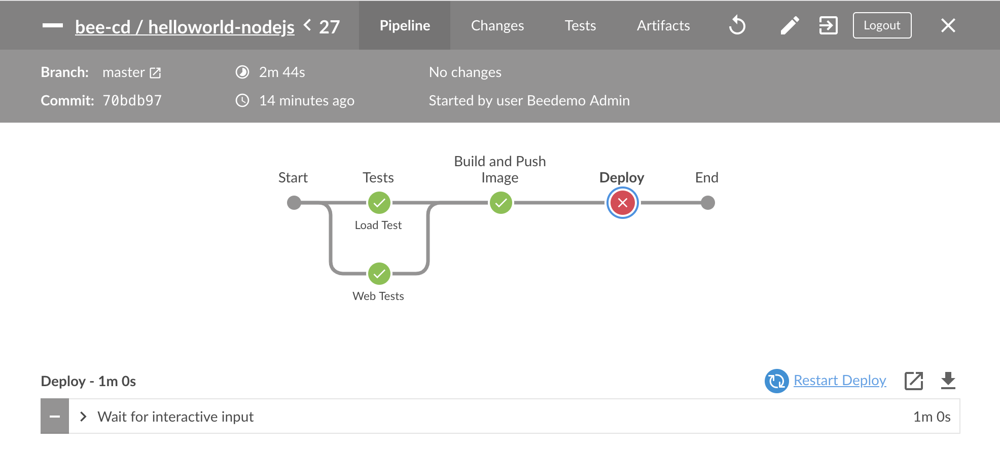

# Pipeline Artifacts and Restartable, Parallel and Sequential Stages with CloudBees Core

The ability to define stages to run in parallel is an important feature of Jenkins Pipeline jobs. The Declarative Pipeline syntax has extended support for [parallel stages](https://jenkins.io/doc/book/pipeline/syntax/#parallel), [sequential stages](https://jenkins.io/doc/book/pipeline/syntax/#sequential-stages) and nested stages - and all of these features are nicely visualized in the Blue Ocean UI. In this set of exercises, we will use sequential `stages` and Pipeline parallelization to speed up the execution of some web tests and a load test that we will add for our **helloworld-nodejs** app.

We will also take a look at the archiving of artifacts - or more specifically, stashing build artifacts and a explore a more advanced usage of the Kubernetes plugin by defining `agents` inline in our Pipeline Jenkinsfile and finally, we will explore the use of [Pipeline Shared Libraries](https://jenkins.io/doc/book/pipeline/shared-libraries/) [**resources**](https://jenkins.io/doc/book/pipeline/shared-libraries/#loading-resources) to make our `Jenkinsfile` more readable.

>**Starting Here or Catching Up?**
>
>If you are starting with this set of exercises or just need to catch up, you may get the the correct version of the  **nodejs-app/Jenkinsfile.template** Pipeline script for starting these exercises [from this branch](https://github.com/cloudbees-cd-acceleration-workshop/custom-marker-pipelines/blob/after-approvals/nodejs-app/Jenkinsfile.template).

## Stash and Unstash

Sometimes you may need to share certain files between `stages` of a `pipeline` but not actually need to archive those files for use once the job run has completed. That is precisely the purpose of the [`stash`](https://jenkins.io/doc/pipeline/steps/workflow-basic-steps/#stash-stash-some-files-to-be-used-later-in-the-build) and [`unstash`](https://jenkins.io/doc/pipeline/steps/workflow-basic-steps/#unstash-restore-files-previously-stashed) steps. We are eventually going to need certain files checked out from **helloworld-nodejs** repository in the **Build and Push Image** `stage` - but we won't need all of the checked out files - like the **test** files. So we will `stash` only the files checked out in the **Test** `stage` that we will need for the the **Build and Push Image** `stage`.

1. Add the following `post` section just below the `steps` section of the **Test** `stage` using the GitHub editor and commit your changes:

```
      post {
        success {
          stash name: 'app', includes: '*.js, public/**, views/*, Dockerfile'
        }
      }
```

2. Remember, `post` sections are available at both the global `pipeline` level and at the individual `stage` level. The reason we added it to the `success` condition of the `post` section is because we only need the `stash` of files if we successfully get past the **Test** `stage`. Now we will add the `unstash` step to the **Build and Push Image** `stage`.

```
    stage('Build and Push Image') {
      agent any
      when {
        beforeAgent true
        branch 'master'
      }
      steps {
        echo "TODO - build and push image"
        unstash 'app'
      }
    }
```

4. Also note that we added `agent any` to the **Build and Push Image** `stage` because the `unstash` step requires a *heavyweight* executor as discussed in the [**Stage Specific Agents and Agent None**](exercises/intro-pipeline-cb-core.md#stage-specific-agents-and-agent-none) lesson - it won't execute successfully on the **fly-weight** executor of the Jenkins master. Next, navigate to the **master** branch of your **helloworld-nodejs** job in Blue Ocean on your Team Master and run the job. You will see files being `stashed` and then `unstashed`.

```
Stashed 4 file(s) to https://cd-accel.s3.amazonaws.com/cb-core/artifacts/beedemod-dev/bee-cd/helloworld-nodejs/master/28/stashes/app.tgz
...
Unstashed file(s) from https://cd-accel.s3.amazonaws.com/cb-core/artifacts/beedemod-dev/bee-cd/helloworld-nodejs/master/28/stashes/app.tgz
```

>**NOTE:** Typically `stash` files are copied from the `agent` to the Jenkins master and `unstash` files are copied from the Jenkins master back to the agent. This results in quite a bit of network IO between the Jenkins master(s) and agents, and has been a source of numerous performance issues with CloudBees customers. So CloudBees developed an AWS S3 based implementation of the [**ArtifactManagerFactory**](https://jenkins.io/doc/developer/extensions/jenkins-core/#artifactmanagerfactory) extension that was added to Jenkins core as of the 2.118 release. The CloudBees developed [Artifact Manager on S3 plugin](https://github.com/jenkinsci/artifact-manager-s3-plugin) integrates transparently with the `archive`/`unarchive` and `stash`/`unstash` Pipeline steps to store those files in an AWS S3 Bucket - with the upload and download happening on the `agent` without any overhead for the Jenkins master. And because of the modern, container based architecture of CloudBees Core on Kubernetes - we were able to [easily add the necessary plugins and configuration to the custom Team Master Docker image being used by everyone by utilizing Configuration-as-Code](https://github.com/kypseli/cb-core-mm/blob/kube-workshop/config-as-code.yml#L16). This made it super easy to provide this cloud native artifact storage for everyones' Team Master - as soon as they were provisioned.

 <p>

## Restartable Stages

Declarative Pipelines support a feature referred to as [***Restartable Stages***](https://jenkins.io/doc/book/pipeline/running-pipelines/#restart-from-a-stage). You can restart any completed Declarative Pipeline from any top-level `stage` which ran in that Pipeline job run. This allows you to re-run a Pipeline from a `stage` which may have failed due to transient or environmental reasons. All inputs to the Pipeline will be the same. This includes SCM information, build parameters, and the contents of any `stash` step calls in the original Pipeline, if specified. Stages which were skipped due to an earlier failure will not be available to be restarted, but `stages` which were skipped due to a `when` condition not being satisfied will be available.

1. Navigate to the **master** branch of your **helloworld-nodejs** job in Blue Ocean on your Team Master.
2. Select the **Build and Push Image** `stage` if it isn't already selected and then click on the ***Restart Build and Push Image*** link. <p>
3. The **Test** `stage` will be skipped, but the job will fail with the following error: <p>
4. So what is going on? By default, a `stash` is removed when a Pipeline job completes, regardless of the result of the Pipeline. But in this case we want to **restart** from a `stage` where we `unstash` files. Declarative Pipeline has the ability to **preserve** a `stash` across job runs for this exact reason - but you must declare it by adding the `preserveStashes` job property to the `pipeline` global `options`. Update the global `options` section of your **nodejs-app/Jenkinsfile.template** Pipeline script:

```
  options { 
    buildDiscarder(logRotator(numToKeepStr: '2'))
    skipDefaultCheckout true
    preserveStashes(buildCount: 2)
  }
```

1. By default, the `preserveStashes` step will only preserve 1 run, but it includes a `buildCount` parameter to set a range from 1 to 50 runs to preserve. We will preserve 2 runs to match the `buildDiscarder` policy configured for our Team Masters. 
2. Next, navigate to the **master** branch of your **helloworld-nodejs** job in Blue Ocean on your Team Master and run the job from the start. This is necessary for the `preserveStash` to take effect and for the `stash` in the **Test** `stage` to get preserved. 
3. Once the job has completed, select the **Build and Push Image** `stage` and then click on the ***Restart Build and Push Image*** link. The `unstash` step in the **Build and Push Image** `stage` will work now and the job will complete successfully. <p>

## Kubernetes Pod Templates Defined in Pipeline Script

Before we take a look at parallelization and sequential stages for Declartive Pipelines we need a reason to use those features. So we will add some tests for our **helloworld-nodejs** app. But, before we add tests to the **nodejs-app/Jenkinsfile.template** Pipeline script we will need an additional Docker *container* for executing tests. We also want to use a different vesion of the **node** Docker image than the one provided by the CJOC *Kubernetes Shared Cloud* which is `node:8.12.0-alpine`. So far we have been using the **nodejs-app** [Kubernetes *Pod Template* defined for us on **CloudBees Jenkins Operations Center (CJOC)**](https://go.cloudbees.com/docs/cloudbees-core/cloud-admin-guide/agents/#_globally_editing_pod_templates_in_operations_center). In order to be able to control what `containers` and what Docker `image` version we use in our Pipeline we will update the **nodejs-app/Jenkinsfile.template** Pipeline script with an [*inline* Kubernetes Pod Template definition](https://github.com/jenkinsci/kubernetes-plugin#declarative-pipeline).

1. Open the GitHub editor for the **nodejs-app/Jenkinsfile.template** Pipeline script in the **master** branch of your forked **custom-marker-pipelines** repository.
2. Replace the `agent` section of the **Test** `stage` with the following:

```
      agent {
        kubernetes {
          label 'nodejs-app-inline'
          yaml """
kind: Pod
metadata:
  name: nodejs-app
spec:
  containers:
  - name: nodejs
    image: node:10.10.1-alpine
    command:
    - cat
    tty: true
  - name: testcafe
    image: 946759952272.dkr.ecr.us-east-1.amazonaws.com/kypseli/testcafe:alpha-1
    command:
    - cat
    tty: true
          """
        }
      }
```

3. The [Kubernetes plugin allows you to use standard Kubernetes Pod yaml configuration](https://github.com/jenkinsci/kubernetes-plugin#using-yaml-to-define-pod-templates) to define Pod Templates directly in your Pipeline script. Commit the changes and then navigate to the **master** branch of your **helloworld-nodejs** job in Blue Ocean on your Team Master and run the job. The job will queue indefinitely, but why? 
4. The answer is provided by the [CloudBees Kube Agent Management plugin](https://go.cloudbees.com/docs/cloudbees-core/cloud-admin-guide/agents/#monitoring-kubernetes-agents). Exit to the classic UI on your Team Master and navigate up to the **helloworld-nodejs** Multibranch folder. On the bottom left of of the screen there is a dedicated widget that provides information about the ongoing provisioning of Kubernetes agents. It also highlights failures, allowing you to determine the root cause of a provisioning failure. Click on the link for the failed or pending pod template. <p>
4. You will see that the **nodejs** container has an error - it looks like there is not a **node** Docker image available with that tag. If you go to [Docker Hub and look at the tags availalbe for the **node** image](https://hub.docker.com/r/library/node/tags/) you will see there is a **10.10.0-alpine** but not a **10.10.1-alpine** tag for the **node** image: <p> 
5. Abort the current run (or it will keep going forever) and open the GitHub editor for the **nodejs-app/Jenkinsfile.template** Pipeline script in the **master** branch of your forked **custom-marker-pipelines** repository. Update the `image` for the **nodejs** `container` to be `node:10.10.0-alpine`.
6. Commit the changes and then navigate to the **master** branch of your **helloworld-nodejs** job in Blue Ocean on your Team Master and run the job. The job will run successfully. Also, note the output of the `sh 'node --version'` step - it is `v10.10.0` instead of `v8.12.0`: <p>

## Pipeline Shared Libraries

For this exercise, you will fork an existing Pipeline Shared Library GitHub repository for this exercise from https://github.com/cloudbees-cd-acceleration-workshop/pipeline-library into the GitHub Organization you created in **[Setup - Create a GitHub Organization](./Setup.md#create-a-github-organization)**.

Once you have forked the ***pipeline-library*** repository into your GitHub Organization you will need to configure it as a Pipeline Shared Library for your Team Master. Pipeline Shared Libraries may be configured at the Jenkins Master level or the Jenkins folder level. The GitHub Oranization project that you created earlier is actually a special type of folder, so we will add the configuration for ***pipeline-library*** to that folder.

1. In the classic UI, navigate into the **GitHub Organization** folder project that you created earlier and click on the **Configure** link in the left navigation menu. Note the breadcrumbs - my **GitHub Organization** folder project is named **bee-cd**. <p>
2. In the **Github Organization** folder configuration screen scroll down to the **Pipeline Libraries** section and click the **Add** button. <p>
3. Enter `cd-accel` for the Library **Name** and `master` for the **Default version**.
4. Make sure that you leave **Allow default version to be overridden** checked - more on this later.
5. For the **Retrieval method** select **Modern SCM**.
6. For the **Source Code Management** select **GitHub**.
7. Select the GitHub **Credentials** you created earlier, enter your GitHub Organization name as the **Owner**, select **pipeline-library** for the **Repository** and then click the **Save** button. <p>

If you navigate back to your fork of the **pipeline-library** repository you will notice that it contains is the *LICENSE* and *README.md* files and a `vars` directory with an empty `defineProps.groovy` file. A Pipeline Shared Library requires a specific directory structure and a `vars` or `src` directory is required in order to load a shared library in your Pipeline script.

### Pipeline Directory Structure

Shared Libraries have a very specific directory structure as follows:

```
(root)
+- src                     # Groovy source files
|   +- org
|       +- foo
|           +- Bar.groovy  # for org.foo.Bar class
+- vars
|   +- foo.groovy          # for global 'foo' variable
|   +- foo.txt             # help for 'foo' variable
+- resources               # resource files (external libraries only)
|   +- org
|       +- foo
|           +- bar.json    # static helper data for org.foo.Bar
```

The `src` directory should look like standard Java source directory structure and will contain Java `Classes` written in `Groovy`. This directory is added to the classpath when executing Pipelines. We won't be going over using Groovy source files for Shared Libraries today, but you can find more information about them [here](https://jenkins.io/doc/book/pipeline/shared-libraries/#accessing-steps).

The `vars` directory hosts scripts that define global variables accessible from Pipeline. The basename of each `.groovy` file should be a Groovy (~ Java) identifier, conventionally `camelCased`. The matching `.txt`, if present, can contain documentation, processed through the system’s configured markup formatter (so it may really be HTML, Markdown, etc., though the `txt` extension is required).

The Groovy source files in these directories get the same “CPS transformation” as in Scripted Pipeline.

A `resources` directory allows the `libraryResource` step to be used to load associated non-Groovy files as a String value in your Pipeline script.

### Using Resource Files from a Shared Library

One of the Shared Library directories mentioned above was the `resource` directory. Shared Libraries make files from the `resources/` directory available to be loaded in your Pipeline script using the `libraryResource` step. The argument is a relative pathname in the `resource` directory. The file is loaded as a string, suitable for passing to certain APIs or using as a the value for a `String` parameter of a Pipeline `step`. We are going to use such a `resource` for the latter use case - as a `String` value of a Pipeline step parameter. We will make our Pipeline script more readable by replacing the inline yaml definition of our `kubernetes` agent `yaml` parameter with the `String` output of a `resource` from our `cd-accel` Shared Library.

1. In the **master** branch of your forked **pipeline-library** repostiory click on the **Create new file** button and enter `resources/podtemplates/nodejs-app/web-test-pod.yml`. 
2. The contents of this file will be the `Pod` configuration from the `yaml` parameter of the `kubernetes` block in the **Test** `stage` of our Pipeline script. Copy and paste that as the content of this new `web-test-pod.yml` `resource` file: 

```
kind: Pod
metadata:
  name: nodejs-testcafe
spec:
  containers:
  - name: nodejs
    image: node:10.10.0-alpine
    command:
    - cat
    tty: true
  - name: testcafe
    image: 946759952272.dkr.ecr.us-east-1.amazonaws.com/kypseli/testcafe:alpha-1
    command:
    - cat
    tty: true
```

3. Commit the changes.
4. Open the GitHub editor for the **nodejs-app/Jenkinsfile.template** Pipeline script in the **master** branch of your forked **custom-marker-pipelines** repository.
5. Add the following line to the very top of the Pipeline script, above the `pipeline` block - remember that we named the Shared Library **cd-accel** when we added it to our GitHub Organization project on our Team Masters:

```
library 'cd-accel'
```
6. Just below the `library 'cd-accel'` step, add the following - *note that we are specifying the relative path to `web-test-pod.yml` from the `resources` directory*:

```groovy
library 'cd-accel'
def testPodYaml = libraryResource 'podtemplates/nodejs-app/web-test-pod.yml'
```

7. Next, update the `label` to `'nodejs-testcafe'` and the `yaml` argument for the `kubernetes` block so your `agent` for the **Test** `stage` matches the following and commit the changes:

```
      agent {
        kubernetes {
          label 'nodejs-testcafe'
          yaml testPodYaml
        }
      }
```

8. Wow, that really makes our Jenkinsfile much more readable. Next, navigate to the **master** branch of your **helloworld-nodejs** job in Blue Ocean on your Team Master and run the job. The job will run successfully using the `yaml` definition from the Shared Library you just added to your Pipeline script.

## Web Browser Tests with Testcafe

So far, we have a **Test** `stage` that doesn't really do anything. We are going to change that by executing [Testcafe](http://devexpress.github.io/testcafe/) driven browser tests for the **helloworld-nodejs** app in our Pipeline.

1. Open the GitHub editor for the **nodejs-app/Jenkinsfile.template** Pipeline script in the **master** branch of your forked **custom-marker-pipelines** repository.
2. Update the `steps` section of the **Test** `stage` to match the following:

```groovy
      steps {
        checkout scm
        container('nodejs') {
          sh '''
            npm install express
            npm install pug --save
            node ./hello.js &
          '''
        }
        container('testcafe') {
          sh '/opt/testcafe/docker/testcafe-docker.sh "chromium --no-sandbox" tests/*.js -r xunit:res.xml'
        }
      }
```
3. Notice how we now have 2 `container` blocks - with both containers being provided by our inline Pod Template. Also notice the `xunit:res.xml` part of the **testcafe** `sh` step. **Testcafe**  provides JUnit compatible output and it is useful to have Jenkins record that output for reporting and visualization. We will use the [`junit` step from the the JUnit plugin to capture and display test results](https://jenkins.io/doc/book/pipeline/jenkinsfile/#test) in Jenkins. We will add the `always` condition block to our `post` section of the `test` `stage` - because we want to capture both successful tests and failures:

```groovy
      post {
        success {
          stash name: 'app', includes: '*.js, public/**, views/*, Dockerfile'
        }
        always {
          junit 'res.xml'
        }
      }
```

4. Commit those changes and run the **helloworld-nodejs** **master** branch job and it will fail. It failed because the **Testcafe** test did not pass. We can see the exact error under the [**Tests** tab of the Blue Ocean Pipeline Run Details view](https://jenkins.io/doc/book/blueocean/pipeline-run-details/#tests) for this run: <p>
5. So it appears that we have a slight typo in our **helloworld-nodejs** app. Use the GitHub editor to open the `hello.js` file on the **master** branch of your forked copy of the **helloworld-nodejs** repository, fix the misspelling of **Worlld** to **World** and then commit the changes. 
6. Navigate to the **master** branch of your **helloworld-nodejs** job in Blue Ocean on your Team Master and your job should already be running as a GitHub webhook triggered it when you commited the changes for the `hello.js` file in the **helloworld-nodejs** repository. The tests will be pass and the job will complete successfully: <p>

## Simple Load Testing with Apache Benchmark

Now that we have addes some web tests, we will next add a very simple load test utilizing the Apache Benchmark tool. But first we will need to add another Pod Template to the `resources` folder of your **pipeline-library** repostiory.

1. In the **master** branch of your forked **pipeline-library** repostiory click on the **Create new file** button and enter `resources/podtemplates/nodejs-app/load-test-pod.yml`. 
2. The contents of this file will be the following `Pod` configuration and will include the `apache-benchmark` container. Copy and paste the following as the content of this new `load-test-pod.yml` `resource` file: 

```
kind: Pod
metadata:
  name: nodejs-ab
spec:
  containers:
  - name: nodejs
    image: node:10.10.0-alpine
    command:
    - cat
    tty: true
  - name: apache-benchmark
    image: 946759952272.dkr.ecr.us-east-1.amazonaws.com/kypseli/apache-benchmark:alpine3.8-2.4
    command:
    - cat
    tty: true
```

3. Commit the changes.
4. Open the GitHub editor for the **nodejs-app/Jenkinsfile.template** Pipeline script in the **master** branch of your forked **custom-marker-pipelines** repository.
5. Just below the `libraryResource` step for the `web-test-pod.yml`, add the following - *note that we are specifying the relative path to `load-test-pod.yml` from the `resources` directory*:

```groovy
def loadTestPodYaml = libraryResource 'podtemplates/nodejs-app/load-test-pod.yml'
```

6. Next, we will add a new **Load Test** stage using `loadTestPodYaml` as the `yaml` argument for the `kubernetes` based `agent`:

```
    stage('Load Test') {  
      agent {
        kubernetes {
          label 'nodejs-ab'
          yaml loadTestPodYaml
        }
      }
      steps {
        checkout scm
        container('nodejs') {
          sh '''
            npm install express
            npm install pug --save
            node ./hello.js &
          '''
        }
        container('apache-benchmark') {
          sh 'ab -n 10 -c 4 -s 5 http://localhost:8080/'
        }
      }
    }  
```

1. Navigate to the **master** branch of your **helloworld-nodejs** job in Blue Ocean on your Team Master and run the job. The job will complete successfully.

## Parallel Stages

So now we have a **Test** `stage` and a **Load Test** `stage` that run sequentially. In practice, if each stage took 30 minutes to complete, then that would be 60 minutes for both stages! Of course these tests are rather simple and don't take that long, but it would certainly be valualbe to understand how to parallelize certain steps when there are longer running tests or other long running steps that can be parallelized.

Fortunately, Jenkins Pipeline has built-in functionality for executing Pipeline steps in parallel, implemented in the aptly named `parallel` step. We will refactor our Pipeline to use the [`parallel` block for Declarative Pipelines](https://jenkins.io/doc/book/pipeline/syntax/#parallel) to run the **Test** and **Load Test** stages at the same time.

1. Open the GitHub editor for the **nodejs-app/Jenkinsfile.template** Pipeline script in the **master** branch of your forked **custom-marker-pipelines** repository.
2. Next, we will add a *parent* stage with a `parallel` block to contain the two test stages and we will rename the **Test** `stage` to **Web Tests**:

```groovy
    stage('Tests') {
      parallel {
        stage('Web Tests') {
          agent {
            kubernetes {
              label 'nodejs-testcafe'
              yaml testPodYaml
            }
          }
          steps {
            checkout scm
            container('nodejs') {
              sh '''
                npm install express
                npm install pug --save
                node ./hello.js &
              '''
            }
            container('testcafe') {
              sh '/opt/testcafe/docker/testcafe-docker.sh "chromium --no-sandbox" tests/*.js -r xunit:res.xml'
            }
          }
          post {
            success {
              stash name: 'app', includes: '*.js, public/**, views/*, Dockerfile'
            }
            always {
              junit 'res.xml'
            }
          }      
        }
        stage('Load Test') {  
          agent {
            kubernetes {
              label 'nodejs-ab'
              yaml loadTestPodYaml
            }
          }
          steps {
            checkout scm
            container('nodejs') {
              sh '''
                npm install express
                npm install pug --save
                node ./hello.js &
              '''
            }
            container('apache-benchmark') {
              sh 'ab -n 10 -c 4 -s 5 http://localhost:8080/'
            }
          }
        }
      }
    }
```

3. Note that we are executing the `checkout scm`  and the `nodejs` steps twice - once for each parallel stage. That doesn't seem efficient - but it is because the `parallel` block for Declarative syntax does not allow you to define an `agent` section and a `parallel` block at the same level. More specifically, **you can have ONLY ONE of either `agent`, `parallel` or `stages` as a child of the `stage` directive**. 
4. Commit the changes and navigate to the **master** branch of your **helloworld-nodejs** job in Blue Ocean on your Team Master and run your job. It will complete successfully, and note the nice visualization of the parallel stages in Blue Ocean:  <p> <p>Also note that even though the **Load Test** `stage` is selected, the restart stage link text is **Restart Tests** - that is because you can only [restart top-level stages](https://jenkins.io/doc/book/pipeline/running-pipelines/#restart-from-a-stage) and not parallel or nested stages.

## Sequential Stages

Running in parallel doesn't save a lot of time for our simple **helloworld-nodejs** app, but would obviously be very beneficial for longer running tests. Now we will take a look at how *Sequential Stages* might be useful in making the output in Blue Ocean easier to follow by separating the **nodejs** setup steps from the actual **test** steps.

1. Open the GitHub editor for the **nodejs-app/Jenkinsfile.template** Pipeline script in the **master** branch of your forked **custom-marker-pipelines** repository.
2. Replace the entire **Tests** `stage` with the sequential stages version below:

```groovy
    stage('Tests') {
      parallel {
        stage('Web Tests') {
          agent {
            kubernetes {
              label 'nodejs-testcafe'
              yaml testPodYaml
            }
          }
          stages {
            stage('Nodejs Setup') {
              steps {
                checkout scm
                container('nodejs') {
                  sh '''
                    npm install express
                    npm install pug --save
                    node ./hello.js &
                  '''
                }
              }   
            }
            stage('Testcafe') {
              steps {
                container('testcafe') {
                  sh '/opt/testcafe/docker/testcafe-docker.sh "chromium --no-sandbox" tests/*.js -r xunit:res.xml'
                }
              }   
            }
          }  
          post {
            success {
              stash name: 'app', includes: '*.js, public/**, views/*, Dockerfile'
            }
            always {
              junit 'res.xml'
            }
          } 
        }
        stage('Load Test') {
          agent {
            kubernetes {
              label 'nodejs-ab'
              yaml loadTestPodYaml
            }
          }
          stages {
            stage('Nodejs Setup') {
              steps {
                checkout scm
                container('nodejs') {
                  sh '''
                    npm install express
                    npm install pug --save
                    node ./hello.js &
                  '''
                }
              }   
            }
            stage('Apache Benchmark') {  
              steps {
                container('apache-benchmark') {
                  sh 'ab -n 10 -c 4 -s 5 http://localhost:8080/'
                }
              }
            }
          }
        }
      }
    }
```

3. Navigate to the **master** branch of your **helloworld-nodejs** job in Blue Ocean on your Team Master and run the job. It will complete successfully: <p> Note that, just like with parallel stages, you can only restart from the top-level **Tests** `stage`. <p> Although it makes our Jenkinsfile slight more verbose, using **Sequential Stages** let's us see exactly what our Pipeline is doing in Blue Ocean.

## Next Lesson

Before moving on to the next lesson you can make sure that your **nodejs-app/Jenkinsfile.template** Pipeline script is correct by comparing to or copying the one from the **after-parallel** branch of your forked **custom-marker-pipelines** repository.

You may proceed to the next set of exercises - **[Advanced Pipelines with CloudBees Core](./advanced-pipeline-cb-core.md)** - when your instructor tells you.

## Extra Credit

Using the *Sequential Stages* feature, place the **Build and Push Image**  and **Deploy** into nested `stages` sharing a top-level `when` block. The [answer is here](https://github.com/cloudbees-cd-acceleration-workshop/custom-marker-pipelines/blob/extra-credit-nested-stages/nodejs-app/Jenkinsfile.template).
