# Introduction to Pipelines with CloudBees Core

In addition to all the freely available [Jenkins Pipeline features](https://jenkins.io/doc/book/pipeline/), CloudBees Core provides additional features and capabilities that make it easier and faster for organizations of any size to implement and manage Jenkins Pipelines for Continuous Delivery. We like to refer to it as CD Acceleration.

## GitHub Organization Project

In this exercise we are going to create a special type of Jenkins Pipeline project referred to as an [*Organization Folder*](https://jenkins.io/doc/book/pipeline/multibranch/#organization-folders) and more specifically a *GitHub Organization* project. The *GitHub Organization* project will scan a GitHub Organization to discover the organization’s repositories, automatically creating **managed** *Multibranch Pipeline* jobs for any repository with at least one branch containing a *project recognizer* - typically **Jenkinsfile**. We will use the GitHub Organization that you created in **[Setup - Create a GitHub Organization](./Setup.md#create-a-github-organization)**.

We must exit the Blue Ocean UI to the Jenkins classic UI to complete the steps in this lesson.

1. Click the ***Go to classic*** icon at the top of common section of Blue Ocean’s navigation bar. <p>

Now, let's add your GitHub credentials to the Jenkins' Credentials manager to be used for the *GitHub Organization* project we will create next:

1. Navigate back to your personal folder in Jenkins
2. Click on **Credentials**
3. Click on the **(global)** link under **Stores Scoped to [YourFolderName]** (in this case **beedemo-dev**) <p>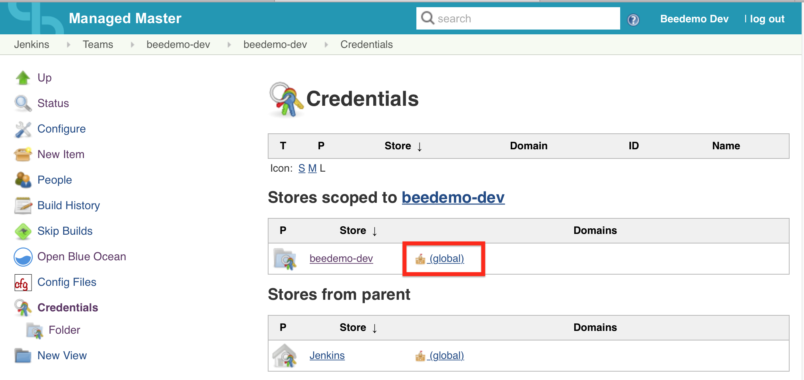
4. Click on **Add Credentials** in the left menu <p>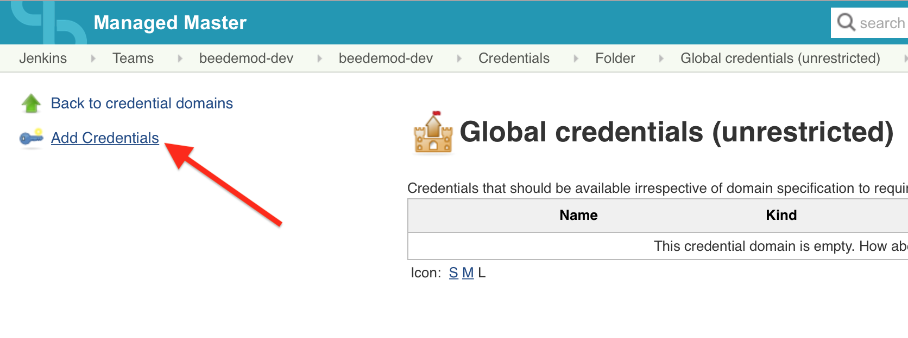
5. Fill out the form (**Username with password**)
  - **Username**: The GitHub user name
  - **Password**: Your GitHub personal access token [created in setup](../Setup.md#create-a-github-personal-access-token)
  - **ID**: Create an ID for your credentials (something like **yourorg-github-token**)
  - **Description**: Can be left blank if you want <p>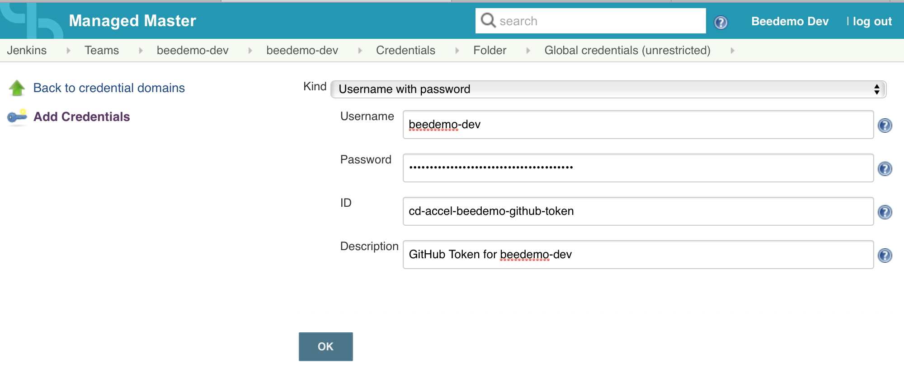
6. Click on **OK**

Now let's create the Github Organization project:

1. Click on **New Item** - make sure that you are in the folder with the same name as your team, and not at the root of your Team Master <p>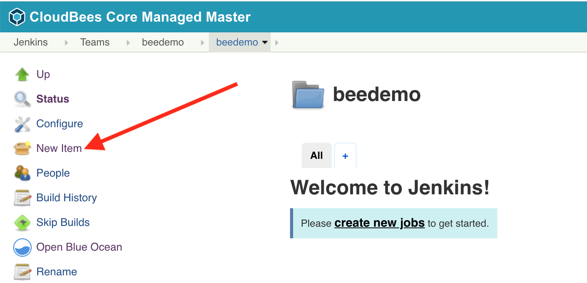 
2. Enter your GitHub Organization name as the **Item Name** 
3. Select **GitHub Organization** <p>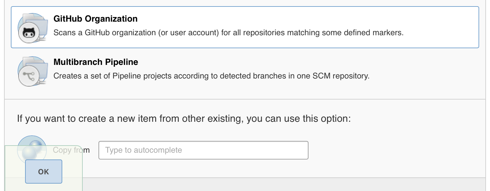
4. Click **Ok**
5. Select the credentials you created above from the **Credentials** drop down <p>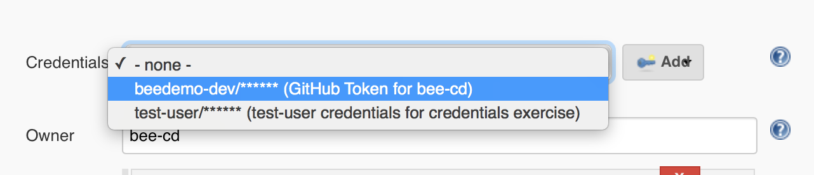
7. Make sure that the **Owner** field matches the name of your GitHub Organization name. <p>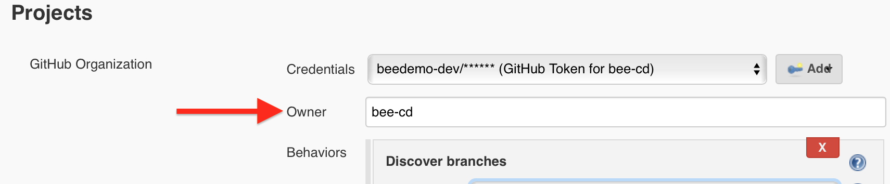
8. **DON'T SAVE YET**

Continue to the next exercise.

## Project Recognizers with Custom Marker Files

In this exercise we are going to demonstrate how you can use the **[Custom Marker feature](https://go.cloudbees.com/docs/cloudbees-documentation/cje-user-guide/#pipeline-custom-factories)** of CloudBees Core to associate an externally managed Pipeline script to a job based on any arbitrary **marker file** like `pom.xml` or something slightly more declarative like `.nodejs-app`.

In order to complete the following exercise you should have [forked the following repositories](../Setup.md#fork-the-workshop-repositories) into the Github Organization you created in **[Setup - Create a GitHub Organization](../Setup.md#create-a-github-organization)**:

1. https://github.com/cloudbees-cd-acceleration-workshop/custom-marker-pipelines 
2. https://github.com/cloudbees-cd-acceleration-workshop/helloworld-nodejs 

Your GitHub Organization should look like the following with those two forked repositories:
<p>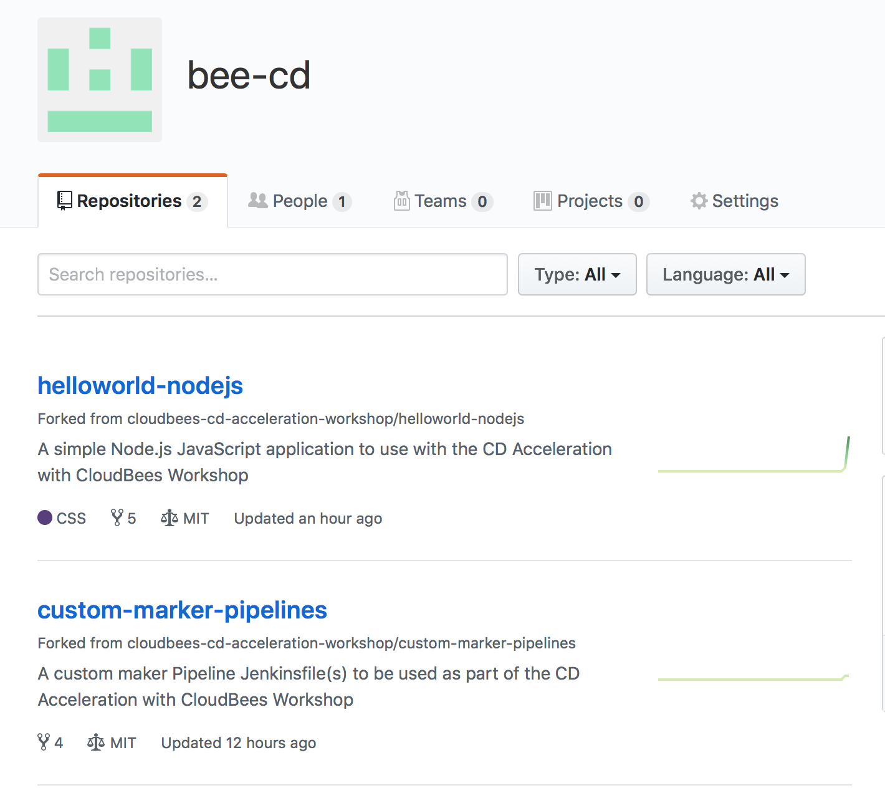

Once those repositories are forked:

1. In the **Github Organization** folder Jenkins project you started to create in the previous exercise scroll down to the **Project Recognizers** section.
2. Delete the default **Project Recognizer** **Pipeline Jenkinsfile**. <p>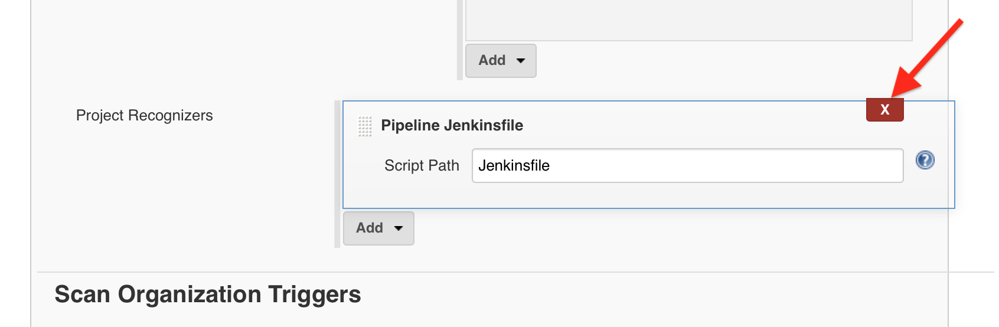
3. Next, under **Project Recognizers** click the **Add** button and select **Custom Script** <p>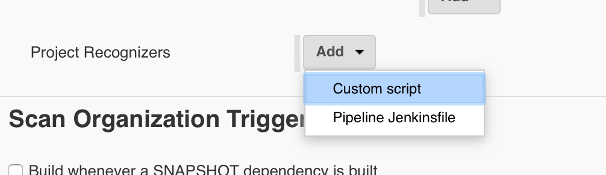
3. In **Marker file** type `.nodejs-app`
4. Under **Pipeline** - **Definition** select **Pipeline script from SCM**
5. Select **Git** for the **SCM** drop-down
6. In **Repository URL** enter: `https://github.com/{your_org_name}/custom-marker-pipelines`
7. Select the credentials you created in the previous exercise.
8. In **Script path** enter: `nodejs-app/Jenkinsfile.template`. Other than the GitHub Organization name it should look like the following: <p>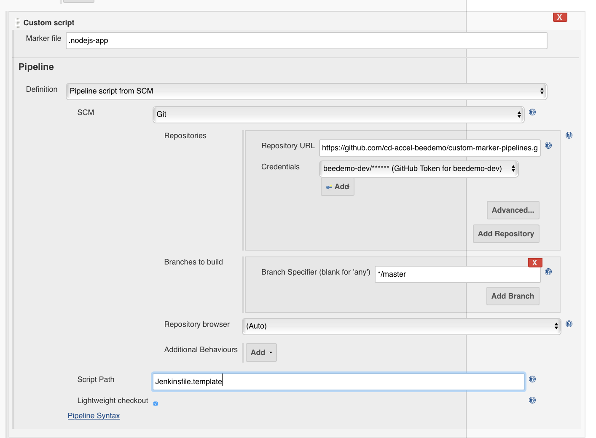
9. Click on **Save**
10. After the scan is complete, click on the bread-crumb link to go back to your **Github Organization** folder Jenkins project <p>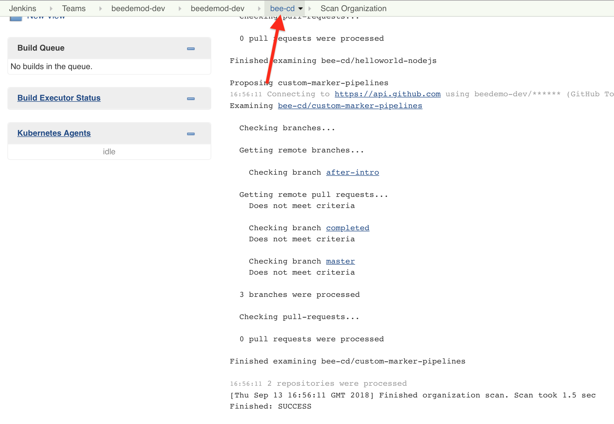
11. When the scan is complete your **Github Organization** project should be **empty**! <p>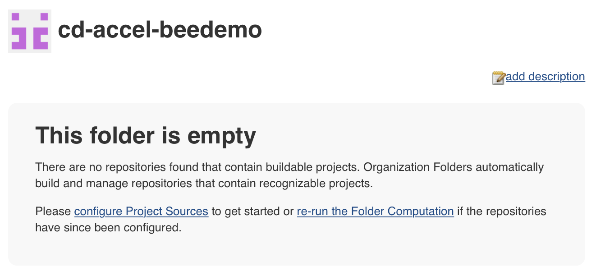 <p>But, when the project was created it also should have created a webhook in Github. Verify that the webhook was created in Github by checking **Webhooks** within your Organization's Github **Settings**. <p>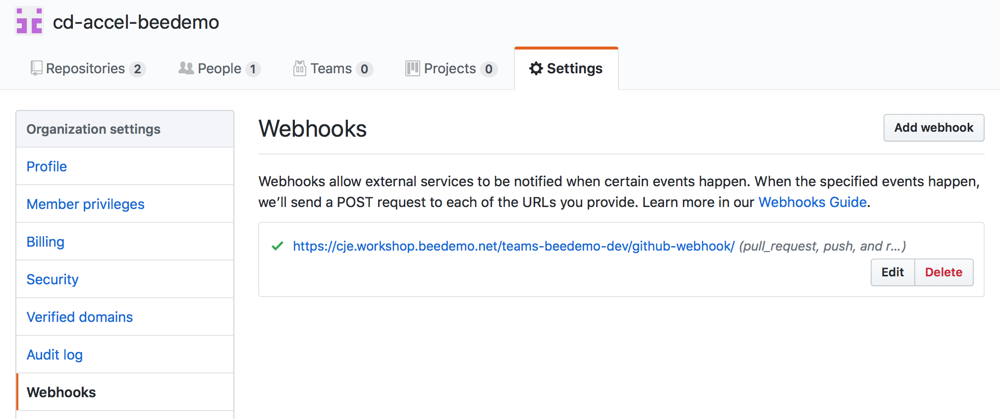
12. In your forked copy of the **helloworld-nodejs** repository click on the **Create new  file** button towards the top right of the screen. <p>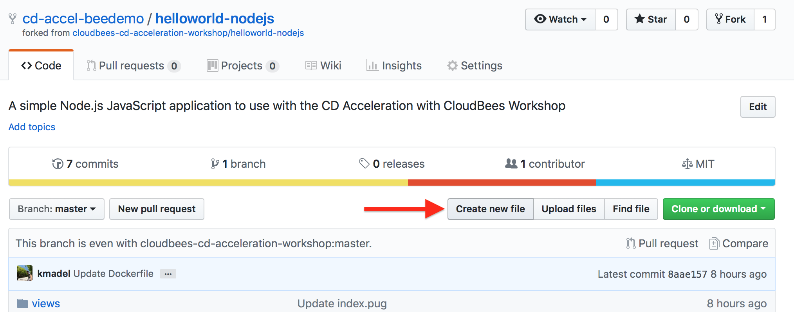
13. Name the file `.nodejs-app` - no need to add any content - and click the **Commit new file** button at the bottom of the screen to save it your repository master branch.  <p>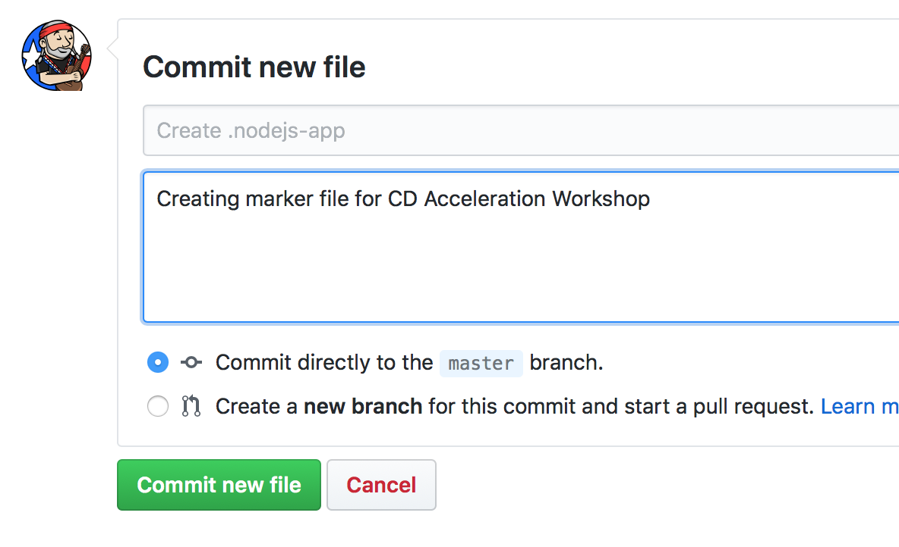
14. Navigate back to your GitHub Organization Folder project on your CloudBees Team Master and voila (*Disclaimer: You may need to refresh your browser*) - you have a new [Pipeline Multibranch project](https://jenkins.io/doc/book/pipeline/multibranch/) mapped to the the **helloworld-nodejs** repository thanks to the the GitHub Organization webhook that was created when we first save the GitHub Organization Folder project. Notice how the **helloworld-nodej** Multibranch Pipeline project's description came from the GitHub repository description. <p>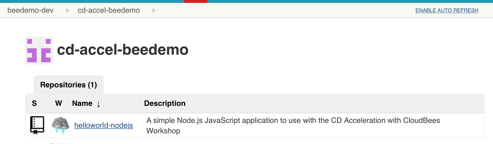

> **NOTE:** The ***custom-marker-files*** repository does not get added to your **Github Organization** project since in doesn't and will never contain a matching marker file: `.nodejs-app`.

For the purposes of this workshop everyone is creating and updating their own fork of the **custom-marker-pipelines** repository and `nodejs-app/Jenkinsfile.template` Pipeline script. However, if you were all part of the same organization and each had one or more Node.js apps - then you would all get instant CD as soon as you added the `.nodjs-app` file to your repository and all of the organizations managed Node.js apps would use the same `nodejs-app/Jenkinsfile.template` Pipeline script.

## Basic Declarative Syntax Structure

In the previous lesson your Pipeline should have run and will have failed. <p>

In this exercise we will update the `nodejs-app/Jenkinsfile.template` Declarative Pipeline using the GitHub editor so that it will actually do something as opposed to resulting in the following errors:

```
WorkflowScript: 1: Missing required section "stages" @ line 1, column 1.
   pipeline {
   ^

WorkflowScript: 1: Missing required section "agent" @ line 1, column 1.
   pipeline {
   ^

2 errors
```

[Declarative Pipelines](https://jenkins.io/doc/book/pipeline/syntax/#declarative-pipeline) must be enclosed within a `pipeline` block - which we have. But Declarative Pipelines must also contain a top-level `agent` declaration, and must contain exactly one `stages` block. The `stages` block must have at least one `stage` block but can have an unlimited number of additional `stage` blocks. Each `stage` block must have exactly one `steps` block. 

1. We will use the GitHub file editor to update the `nodejs-app/Jenkinsfile.template` file in your forked **customer-marker-pipelines** repository. Navigate to the `custom-marker-pipelines/nodejs-app/Jenkinsfile.template` file in your forked repository and then click on the pencil icon to the upper right to edit that file. <p>

> NOTE: Remember we are using a CloudBees Core feature that allows us to specify a Pipeline script from a different source code repository that the one where the application code is committed.

2. Replace the contents of that file with the following Declarative Pipeline:

```groovy
pipeline {
   agent any
   stages {
      stage('Say Hello') {
         steps {
            echo 'Hello World!'   
            sh 'java -version'
         }
      }
   }
}
```

3. Add a commit description and then click the **Commit Changes** button with the default selection of *Commit directly to the master branch* selected.
4. Navigate back to the **helloworld-nodejs** *master* branch job on your Team Master and click the **Build Now** button in the left menu. <p>
5. Your job should complete successfully. Note some things from the log:
  
   1. The custom marker script - `nodejs-app/Jenkinsfile.template` - is being pulled from your forked *custom-marker-pipelines* forked repository:

  ```
  ...
  Obtained nodejs-app/Jenkinsfile.template from git https://github.com/cd-accel-beedemo/custom-marker-pipelines.git
  ...
  ```

  2. The agent is being provisioned from a Kubernetes Pod Template (more on this in the next lesson):

  ```
  ...
  Agent default-jnlp-0p189 is provisioned from template Kubernetes Pod Template
  ...
  ```

  3. Your fork of the **helloworld-nodejs** repository is being checked out, even though you did not put any steps in the `nodejs-app/Jenkinsfile.template` to do so:

  ```
  ...
  Cloning repository https://github.com/cd-accel-beedemo/helloworld-nodejs.git
  ...
  ```

  4. The agent has a Java version of `1.8.0_171`:

```
...
Running shell script
+ java -version
openjdk version "1.8.0_171"
...
```
  
> **NOTE:** You may have noticed that your Pipeline GitHub repository is being cloned even though you didn't specify that in your Jenkinsfile. Declarative Pipeline checks out source code by default using the `checkout scm` step.

## The options Directive

The [`options` directive](https://jenkins.io/doc/book/pipeline/syntax/#options) allows configuring Pipeline-specific options from within the Pipeline itself. We are going to add the `buildDiscarder` `option` to the `nodejs-app/Jenkinsfile.template` file in your forked **customer-marker-pipelines** repository. As a centrally managed CD service, that will provide easy managment of the *Discard old builds* strategy across all of the jobs that use the `nodejs-app/Jenkinsfile.template` so that storage doesn't become an issue on the CloudBees Team Masters.

1. Use the GitHub file editor to update the `nodejs-app/Jenkinsfile.template` file in your forked **customer-marker-pipelines** repository - adding the following `options` directive below the `agent` section:

```groovy 
  options { 
    buildDiscarder(logRotator(numToKeepStr: '2'))
  }
```

2. **Commit Changes** and then navigate to the **master** branch of your **helloworld-nodejs** job in the classic UI on your Team Master and run the job. Once the job has run at least once, the job configuation will be updated to reflect what was added to the Pipeline script. <p>

> **NOTE:** A Pipeline job must run in Jenkins before any type of Pipeline directive that modifies the job configuration can take effect because there is no way for the Jenkins master to know about it unitl it is runs on the Jenkins master. Also note that for Multibranch Pipeline projects - the only way to modify much of the configuration of branch specific Pipeline jobs is by doing it in the Pipeline script as those jobs are not configurable from the Jenkins UI.

## Kubernetes Agents with CloudBees Core

In this exercise we will get an introduction to the [Jenkins Kubernetes plugin](https://github.com/jenkinsci/kubernetes-plugin/blob/master/README.md) for running dynamic and ephemeral agents in a Kubernetes cluster - leveraging the scaling abilities of Kubernetes to schedule build agents.

CloudBees Core has [built-in support for Kubernetes build agents](https://go.cloudbees.com/docs/cloudbees-core/cloud-admin-guide/agents/#kubernete-agents). The Jenkins Kubernetes based agent is contained in a pod, where a pod is a group of one or more containers sharing a common storage system and network. A pod is the smallest deployable unit of computing that Kubernetes can create and manage (you can read more about pods in the [Kubernetes documentation](https://kubernetes.io/docs/concepts/workloads/pods/pod/)).

>NOTE: One of the containers must host the actual Jenkins build agent (the slave.jar file that is used for communication between the CloudBees Team Master and the agent). By convention, this container always exists (and is automatically added to any Pod Templates that don't define a **Container Template** with the name ***jnlp*** ). It has the ***Name*** `jnlp` and default execution of the Pipeline always happens in this `jnlp` container (as it did when we used `agent any` above) - unless you declare otherwise. If needed, this may be overridden by specifying a **Container Template** with the ***Name*** `jnlp`.

We will use the [Pipeline `container` block](https://jenkins.io/doc/pipeline/steps/kubernetes/#container-run-build-steps-in-a-container) (a Pipeline step from the Kubernetes plugin) to run Pipeline `steps` inside a specific container configured as part of a Jenkins Kubernetes Agent Pod template. In our initial Pipeline, we used `agent any` which required at least one Jenkins agent configured to *Use this node as much as possible* - resulting in the use of a Pod Template that only had a `jnlp` container. But now we want to use Node.js in our Pipeline. Luckily, our CloudBees Core Jenkins Administrator has configured the [CloudBees Core Kubernetes Shared Cloud](https://go.cloudbees.com/docs/cloudbees-core/cloud-admin-guide/agents/#_globally_editing_pod_templates_in_operations_center) to include a Kubernetes Pod Template to provide a Node.js container. <p> <p>Take note of the ***Labels*** field with a value of ***nodejs-app*** and the **Container Template** ***Name*** field with a value of ***nodejs*** - both of these are important and we will need those values to configure our Pipeline to use this **Pod Template** and **Container Template**.

1. Navigate to and click on the **nodejs-app/Jenkinsfile.template** in the file list within your forked **custom-marker-pipelines** repository
2. Click on the **Edit this file** button (pencil)
3. First, we need to update the `agent any` directive with the following so that we will get the correct Kubernetes Pod Template - configured with the **Container Template** with the `node:8.12.0-alpine` Docker image:
```
  agent { label 'nodejs-app' }
```
4. Navigate to the **master** branch of your **helloworld-nodejs** job in Blue Ocean on your Team Master and run the job. <p>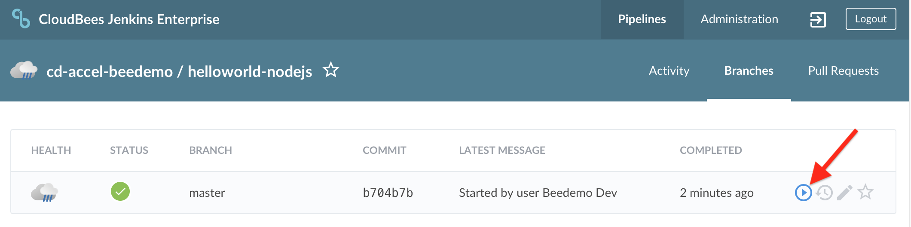 <p>The build logs should be almost the same as before - we are still using the default `jnlp` container. Let's change that by replacing the **Say Hello** `stage` with the following **Test** `stage`:

```groovy
      stage('Test') {
        steps {
          container('nodejs') {
            echo 'Hello World!'   
            sh 'java -version'
          }
        }
      }
```

  All of the Pipeline steps within that `container` block will run in the container specified by the **Name** of the **Container Template** - and in this case that **Container Template** is using the `node:8.12.0-alpine` Docker image. Run the **helloworld-nodejs** job again - it will result in an error because the `nodejs` container does not have Java installed. <p>

>NOTE: If you waited for your job to complete in Blue Ocean before you navigated to the [Pipeline Runs Details View](https://jenkins.io/doc/book/blueocean/pipeline-run-details/#pipeline-run-details-view) you will discover a nice feature where if a particular step fails, the tab with the failed step will be automatically expanded, showing the console log for the failed step as you can see in the image above.

5. We will fix the error in the **Test** `stage` we added above by replacing the `sh 'java -version'` step with the following step:
```
  sh 'node --version'
```
6. Run the **helloworld-nodejs** job again and it will complete successfully with the following output: <p>

## Conditional Execution with when

In this exercise we will edit the `nodejs-app/Jenkinsfile.template` Pipeline script in the **custom-marker-pipelines** repository by adding some conditional logic based on the **helloworld-nodejs** repository branch being built using the [`when` directive](https://jenkins.io/doc/book/pipeline/syntax/#when). We will accomplish this by adding a branch specific `stage` to the `nodejs-app/Jenkinsfile.template` Pipeline script and then creating a new **development** branch in your forked **helloworld-nodejs** repository.

>**NOTE:** Even though we are adding the conditional logic to the `nodejs-app/Jenkinsfile.template` Pipeline script in the **custom-marker-pipelines** repository we are actually creating a new branch in the **helloworld-nodejs** repository which is the one configured as the **Repository** for the **helloworld-nodejs** Multibranch Pipeline project on your Team Master.  <p>

1. Navigate to and open the GitHub editor for the **nodejs-app/Jenkinsfile.template** file in your forked **customer-marker-pipelines** repository
2. Insert the following stage after the existing **Test** stage, commit the change and note the `beforeAgent true` option - this setting will result in the `when` condition being evaluated before acquiring an `agent` for the `stage`:

```
      stage('Build and Push Image') {
         when {
            beforeAgent true
            branch 'master'
         }
         steps {
            echo "TODO - build and push image"
         }
      }
```
3. Next, in GitHub, navigate to your forked **helloworld-nodejs** repository - click on the **Branch** drop down menu, type ***development*** in the input box, and then click on the blue box to create the new branch - ***Create branch: development*** <p>
4. Navigate to the **helloworld-nodejs** job in Blue Ocean on your Team Master. You should see that a new Pipeline job for the new branch was created automatically (thanks to the GitHub webhook that was created earlier) and is running. Note that the ***Build and Push Image*** `stage` was skipped. <p>

>NOTE: Creating the new ***development*** branch in GitHub triggered the webhook that was auto-created when you created the GitHub Organization project on your Team Master resulting in a new Pipeline job being created for the ***development*** branch in the **helloworld-nodejs** Multibranch Pipeline folder. Up until now we hadn't made any commits in your forked **helloworld-nodejs** repository so no webhook events were triggered to kick-off the job on your Team Master. In the image below, note the two branch jobs and the ***Push event*** that triggered the creation of the new **development** job and kicked-off a run for that branch.
<p>

5. Navigate to the **master** branch of your **helloworld-nodejs** job in Blue Ocean on your Team Master and run the job. The new conditional ***Build and Push Image*** `stage` will now run. <p>

## Stage Specific Agents and Agent None

Up to this point we only had one global `agent` defined that is being used by all `stages` of our `pipeline`. However, we don't need an agent for the **Build and Push Image** `stage` (we will be adding Pipeline shared library steps later that will provide agents for that and other additional stages). We will update the Pipeline to have no global `agent` and to have the same 'nodejs-app' `agent` just for the 'Test' `stage`.

1. Navigate to and open the GitHub editor for the **nodejs-app/Jenkinsfile.template** file in the **master** branch of your forked **customer-marker-pipelines** repository.
2. Replace the global `agent` section with the following:

```
  agent none
```

3. Next, in the 'Test' `stage` add the following `agent` section right above the `steps` section:

```
    agent { label 'nodejs-app' }
```

4. You may be asking yourself how the `steps` are able to run in the `stages` where there is no `agent`. Every Pipeline script runs on the Jenkins master using a flyweight executor (i.e. Java thread). However, certain Pipeline `steps` require a heavyweight executor - that is an executor on an `agent` ([more info on flyweight vs heavyweight executors](https://support.cloudbees.com/hc/en-us/articles/360012808951-Pipeline-Difference-between-flyweight-and-heavyweight-Executors)). One such step is the `sh` step. We will add such a step to the **Build and Push Image** `stage` to illustrate this. Add an `sh` step to the **Build and Push Image** stage after the `echo` step so the stage looks like the following:

```
    stage('Build and Push Image') {
      when {
        beforeAgent true
        branch 'master'
      }
      steps {
        echo "TODO - build and push image"
        sh 'node --version'
      }
    }
```

5. Navigate to the **master** branch of your **helloworld-nodejs** job in Blue Ocean on your Team Master and run the job. It will result in the job failing with the following error: 

```
Required context class hudson.FilePath is missing
Perhaps you forgot to surround the code with a step that provides this, such as: node
Attempted to execute a step that requires a node context while ‘agent none’ was specified. Be sure to specify your own ‘node { ... }’ blocks when using ‘agent none’.
```

6. Open the GitHub editor for the **nodejs-app/Jenkinsfile.template** file in the **master** branch of your forked **customer-marker-pipelines** repository and remove the `sh 'node --version'` step from the **Build and Push Image** `stage` and commit the changes.
7. Run the **helloworld-nodejs** **master** branch job again and it will complete successfully.

## Next Lesson

Before moving on to the next lesson you can make sure that your **nodejs-app/Jenkinsfile.template** Pipeline script is correct by comparing to or copying from the **after-intro** branch of your forked **customer-marker-pipelines** repository.

You may proceed to the next set of exercises - **[Pipeline Approvals and Artifact Management with CloudBees Core](./approvals-artifacts-cb-core.md)** - when your instructor tells you. By default, the Pipeline script runs on the Jenkins master, using a lightweight executor (often referred to as a flyweight executor) and is expected to use very few resources.