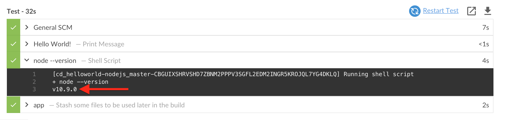

# Parallel and Sequential Stages with CloudBees Core

## Kubernetes Pod Templates Defined in Pipeline Script

So far we have been using the **nodejs-app** Kubernetes Pod Template defined for us on **CloudBees Jenkins Operations Center (CJCO)**. However, for the next stage we will need an additional container for executing tests and we also want to use a different vesion of the **node** Docker image than the one provided by the CJOC Kubernetes Shared Cloud: `node:8.12.0-alpine`. So we will update the **nodejs-app/Jenkinsfile.template** Pipeline script with an *inline* Kubernetes Pod Template definition.

1. Open the GitHub editor for the **nodejs-app/Jenkinsfile.template** Pipeline script in the **master** branch of your forked **customer-marker-pipelines** repository.
2. Replace the `agent` section of the **Test** `stage` with the following:

```
      agent {
        kubernetes {
          label 'nodejs-app-inline'
          yaml """
kind: Pod
metadata:
  name: nodejs-app
spec:
  containers:
  - name: nodejs
    image: node:10.9.0-alpine
    command:
    - cat
    tty: true
  - name: testcafe
    image: beedemo/testcafe@sha256:7cae1a73327d2ef2db61a4fe523bd8ee1697c104e928c1de05f207e0220c890c
    command:
    - cat
    tty: true
          """
        }
      }
```

3. Next, navigate to the **master** branch of your **helloworld-nodejs** job in Blue Ocean on your Team Master and run the job. Note the output of the `sh 'node --version'` step - it is `v10.9.0` instead of `v8.12.0`: <p>

## Tests

So far, we have a **Test** `stage` that doesn't really do anything. We are going to change that by executing a [Testcafe](http://devexpress.github.io/testcafe/) driven test for the **helloworld-nodejs** app in our Pipeline.

1. Open the GitHub editor for the **nodejs-app/Jenkinsfile.template** Pipeline script in the **master** branch of your forked **customer-marker-pipelines** repository.
2. Update the `steps` section of the **Test** `stage` to match the following:

```

```


## Parallel Stages


## Sequential Stages