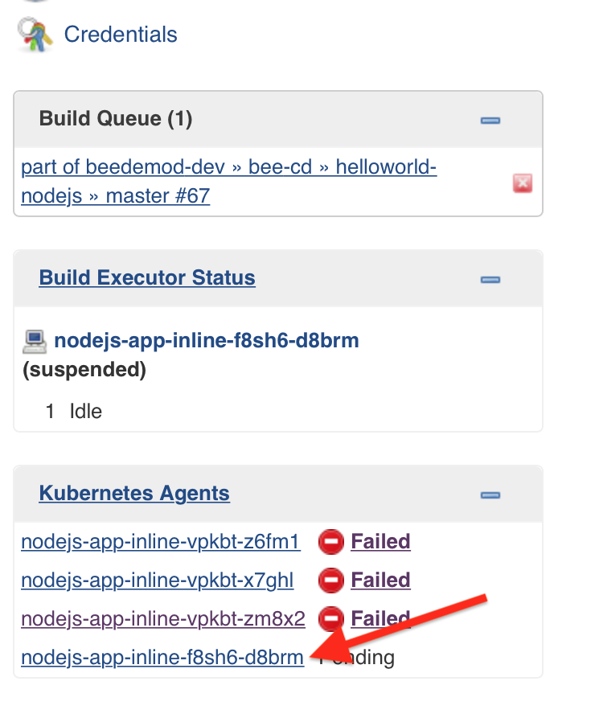
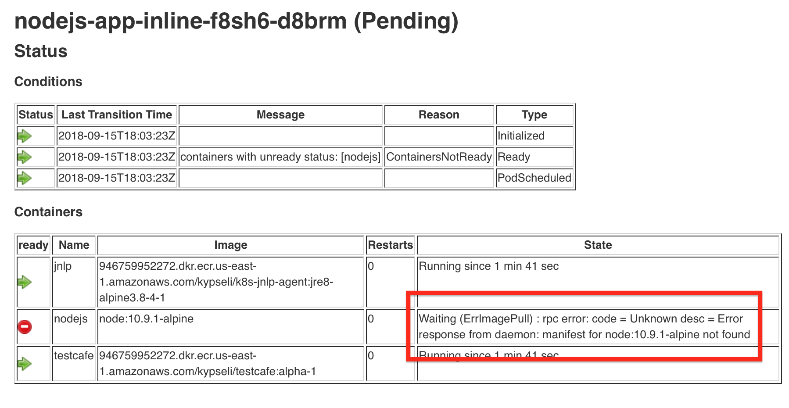
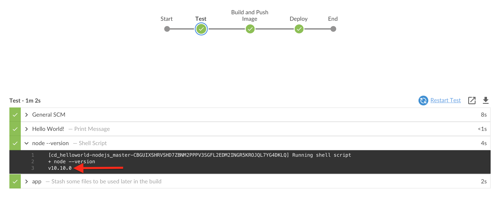
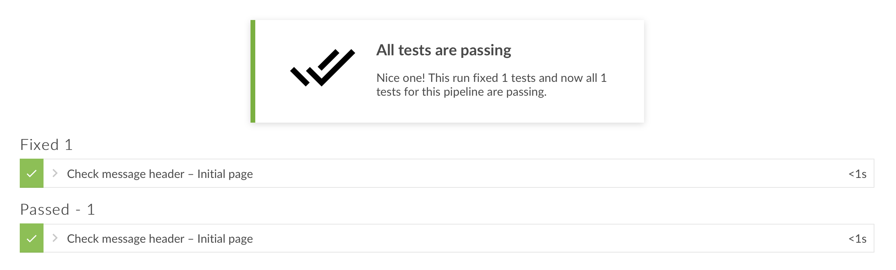
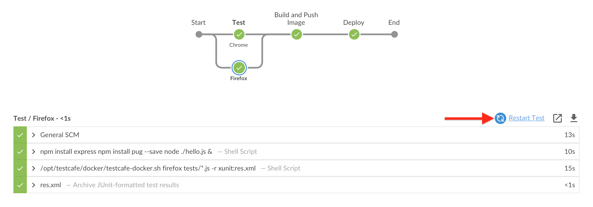
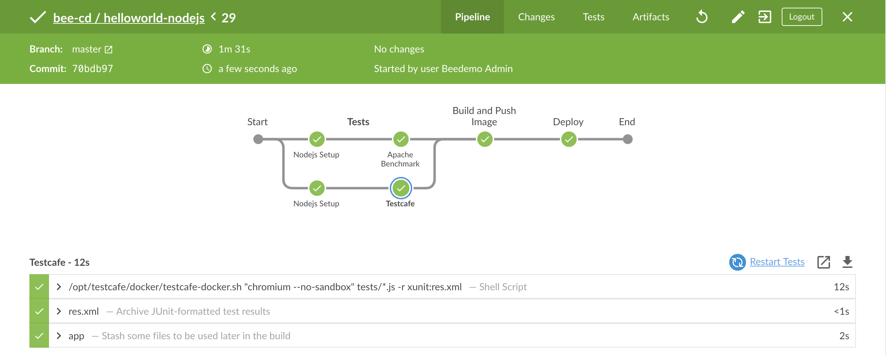
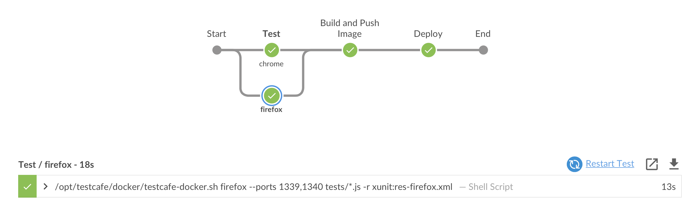
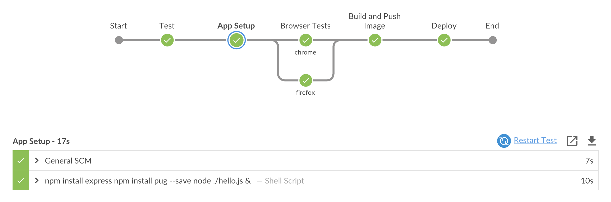

# Parallel and Sequential Stages with CloudBees Core

The ability to define stages to run in parallel is an important feature of Jenkins Pipeline jobs. The Declarative Pipeline syntax has extended support for [parallel stages](https://jenkins.io/doc/book/pipeline/syntax/#parallel), [sequential stages](https://jenkins.io/doc/book/pipeline/syntax/#sequential-stages) and nested stages - and all of these features are nicely visualized in the Blue Ocean UI. In this set of exercises, we will use sequential `stages` and Pipeline parallelization to speed up the execution of the tests we will add for our **helloworld-nodejs** app.

We will also take a look at a more advanced usage of the Kubernetes plugin by defing `agents` right in our Pipeline.

>**Starting Here or Catching Up?**
>
>If you are starting with this set of exercises or just need to catch up, you may get the the correct version of the  **nodejs-app/Jenkinsfile.template** Pipeline script for starting these exercises [from this branch](https://github.com/cloudbees-cd-acceleration-workshop/custom-marker-pipelines/blob/after-approvals/nodejs-app/Jenkinsfile.template).

## Kubernetes Pod Templates Defined in Pipeline Script

Before we take a look at parallelization and sequential stages for Declartive Pipelines we need a reason to use those features. So we will add some real tests for our **helloworld-nodejs** app. However, before we add reals tests to the **nodejs-app/Jenkinsfile.template** Pipeline script we will need an additional Docker *container* for executing tests. We also want to use a different vesion of the **node** Docker image than the one provided by the CJOC *Kubernetes Shared Cloud* which is `node:8.12.0-alpine`. So far we have been using the **nodejs-app** [Kubernetes *Pod Template* defined for us on **CloudBees Jenkins Operations Center (CJCO)**](https://go.cloudbees.com/docs/cloudbees-core/cloud-admin-guide/agents/#_globally_editing_pod_templates_in_operations_center). In order to be able to control what `containers` and what Docker `image` version we use in our Pipeliem we will update the **nodejs-app/Jenkinsfile.template** Pipeline script with an [*inline* Kubernetes Pod Template definition](https://github.com/jenkinsci/kubernetes-plugin#declarative-pipeline).

1. Open the GitHub editor for the **nodejs-app/Jenkinsfile.template** Pipeline script in the **master** branch of your forked **custom-marker-pipelines** repository.
2. Replace the `agent` section of the **Test** `stage` with the following:

```
      agent {
        kubernetes {
          label 'nodejs-app-inline'
          yaml """
kind: Pod
metadata:
  name: nodejs-app
spec:
  containers:
  - name: nodejs
    image: node:10.10.1-alpine
    command:
    - cat
    tty: true
  - name: testcafe
    image: 946759952272.dkr.ecr.us-east-1.amazonaws.com/kypseli/testcafe:alpha-1
    command:
    - cat
    tty: true
          """
        }
      }
```

3. The [Kubernetes plugin allows you to use standard Kubernetes Pod yaml configuration](https://github.com/jenkinsci/kubernetes-plugin#using-yaml-to-define-pod-templates) to define Pod Templates directly in your Pipeline script. Commit the changes and then navigate to the **master** branch of your **helloworld-nodejs** job in Blue Ocean on your Team Master and run the job. The job will queue indefinitely, but why? 
4. The answer is provided by the [CloudBees Kube Agent Management plugin](https://go.cloudbees.com/docs/cloudbees-core/cloud-admin-guide/agents/#monitoring-kubernetes-agents). Exit to the classic UI on your Team Master and navigate up to the **helloworld-nodejs** Multibranch folder. On the bottom left of of the screen there is a dedicated widget that provides information about the ongoing provisioning of Kubernetes agents. It also highlights failures, allowing you to determine the root cause of a provisioning failure. Click on the link for the failed or pending pod template. <p>
4. You will see that the **nodejs** container has an error - it looks like there is not a **node** Docker image available with that tag. If you goto [Docker Hub and look at the tags availalbe for the **node** image](https://hub.docker.com/r/library/node/tags/) you will see there is a **10.10.0-alpine** but not a **10.10.1-alpine** tag for the **node** image: <p> 
5. Abort the current run (or it will keep going forever) and open the GitHub editor for the **nodejs-app/Jenkinsfile.template** Pipeline script in the **master** branch of your forked **custom-marker-pipelines** repository. Update the `image` for the **nodejs** `container` to be `node:10.10.0-alpine`.
6. Commit the changes and then navigate to the **master** branch of your **helloworld-nodejs** job in Blue Ocean on your Team Master and run the job. The job will run successfully. Also, note the output of the `sh 'node --version'` step - it is `v10.10.0` instead of `v8.12.0`: <p>

## Tests with Testcafe

So far, we have a **Test** `stage` that doesn't really do anything. We are going to change that by executing [Testcafe](http://devexpress.github.io/testcafe/) driven browser tests for the **helloworld-nodejs** app in our Pipeline.

1. Open the GitHub editor for the **nodejs-app/Jenkinsfile.template** Pipeline script in the **master** branch of your forked **custom-marker-pipelines** repository.
2. Update the `steps` section of the **Test** `stage` to match the following:

```groovy
      steps {
        checkout scm
        container('nodejs') {
          sh '''
            npm install express
            npm install pug --save
            node ./hello.js &
          '''
        }
        container('testcafe') {
          sh '/opt/testcafe/docker/testcafe-docker.sh "chromium --no-sandbox,firefox" tests/*.js -r xunit:res.xml'
        }
      }
```
3. Notice how we now have 2 `container` blocks - with both containers being provided by our inline Pod Template. Also notice the `xunit:res.xml` part of the **testcafe** `sh` step. **Testcafe**  provides JUnit compatible output and it is useful to have Jenkins record that output for reporting and visualization. We will use the [`junit` step from the the JUnit plugin to captured and display test results](https://jenkins.io/doc/book/pipeline/jenkinsfile/#test) in Jenkins. We will add the `always` condition block to our `post` section of the `test` `stage` - because we want to capture both successful tests and failures:

```groovy
      post {
        success {
          stash name: 'app', includes: '*.js, public/**, views/*, Dockerfile'
        }
        always {
          junit 'res.xml'
        }
      }
```

4. Commit those changes and run the **helloworld-nodejs** **master** branch job and it will fail. It failed because the **Testcafe** test did not pass. We can see the exact error under the [**Tests** tab of the Blue Ocean Pipeline Run Details view](https://jenkins.io/doc/book/blueocean/pipeline-run-details/#tests) for this run: <p>
5. So it appears that we have a slight typo in our **helloworld-nodejs** app. Use the GitHub editor to open the `hello.js` file on the **master** branch of your forked copy of the **helloworld-nodejs** repository, fix the misspelling of **Worlld** to **World** and then commit the changes. 
6. Navigate to the **master** branch of your **helloworld-nodejs** job in Blue Ocean on your Team Master and your job should already be running as a GitHub webhook triggered it when you commited the changes for the `hello.js` file in the **helloworld-nodejs** repository. The tests will be pass and the job will complete successfully: <p>

## Parallel Stages

The example in the section above runs tests across two different browsers - Chromium and Firefox - linearlly. In practice, if the tests took 30 minutes to complete, the "Test" stage would take 60 minutes to complete! Of course these tests are rather simple and don't take that long, but it would certainly be valualbe to understand how to parallelize certain steps when there are longer running tests or other long running steps that can be parallelized.

Fortunately, Pipeline has built-in functionality for executing Pipeline steps in parallel, implemented in the aptly named `parallel` step. We will refactor the example above to use the [`parallel` block for Declarative Pipelines](https://jenkins.io/doc/book/pipeline/syntax/#parallel).

1. Open the GitHub editor for the **nodejs-app/Jenkinsfile.template** Pipeline script in the **master** branch of your forked **custom-marker-pipelines** repository.
2. Replace the entire **Test** `stage` with the parallel stages version below (I know, it is very long):

```groovy
    stage('Test') {
      parallel {
        stage('Chrome') {
          agent {
            kubernetes {
              label 'nodejs-app-inline'
              yaml """
    kind: Pod
    metadata:
      name: nodejs-app
    spec:
      containers:
      - name: nodejs
        image: node:10.9.0-alpine
        command:
        - cat
        tty: true
      - name: testcafe
        image: 946759952272.dkr.ecr.us-east-1.amazonaws.com/kypseli/testcafe:alpha-1
        command:
        - cat
        tty: true
              """
            }
          }          
          steps {
            checkout scm
            container('nodejs') {
              sh '''
                npm install express
                npm install pug --save
                node ./hello.js &
              '''
            }
            container('testcafe') {
              sh '/opt/testcafe/docker/testcafe-docker.sh "chromium --no-sandbox" tests/*.js -r xunit:res.xml'
            }
          }
          post {
            success {
              stash name: 'app', includes: '*.js, public/**, views/*, Dockerfile'
            }
            always {
              junit 'res.xml'
            }
          } 
        }
        stage('Firefox') {
          agent {
            kubernetes {
              label 'nodejs-app-inline'
              yaml """
    kind: Pod
    metadata:
      name: nodejs-app
    spec:
      containers:
      - name: nodejs
        image: node:10.9.0-alpine
        command:
        - cat
        tty: true
      - name: testcafe
        image: 946759952272.dkr.ecr.us-east-1.amazonaws.com/kypseli/testcafe:alpha-1
        command:
        - cat
        tty: true
              """
            }
          }
          steps {
            checkout scm
            container('nodejs') {
              sh '''
                npm install express
                npm install pug --save
                node ./hello.js &
              '''
            }
            container('testcafe') {
              sh '/opt/testcafe/docker/testcafe-docker.sh firefox tests/*.js -r xunit:res.xml'
            }
          }
          post {
            always {
              junit 'res.xml'
            }
          }          
        }
      }
    }
```

3. We are duplicating the `agent` section and the `post` sections for capturing test results with the `junit` step. We are also executing the `nodejs` steps twice. That doesn't seem efficient - but it is because the `parallel` block for Declarative syntax does not allow you to define an `agent` section and a `parallel` block at the same level. More specifically, **you can have ONLY ONE of either `agent`, `parallel` or `stages` as a child of the `stage` directive**. 
4. Commit the changes and navigate to the **master** branch of your **helloworld-nodejs** job in Blue Ocean on your Team Master and run your job. It will complete successfully, and note the nice visualization of the parallel stages in Blue Ocean:  <p> <p>Also note that even though the **Firefox** `stage` is selected, the restart stage link text is **Restart Test** - that is because you can only [restart top-level stages](https://jenkins.io/doc/book/pipeline/running-pipelines/#restart-from-a-stage) and not parallel or nested stages.

## Sequential Stages

Running in parallel does not make a lot sense for our **helloworld-nodejs** app. It doesn't make sense to run the `nodejs` `container` steps twice, having two separate and identical Kuberentes Pods running, and duplicating the `junit` step. Perhaps nested sequential stages would be a better solution.

1. Open the GitHub editor for the **nodejs-app/Jenkinsfile.template** Pipeline script in the **master** branch of your forked **custom-marker-pipelines** repository.
2. Replace the entire **Test** `stage` with the sequential stages version below:

```groovy
    stage('Test') {
      agent {
        kubernetes {
          label 'nodejs-app-inline'
          yaml """
kind: Pod
metadata:
  name: nodejs-app
spec:
  containers:
  - name: nodejs
    image: node:10.9.0-alpine
    command:
    - cat
    tty: true
  - name: testcafe
    image: 946759952272.dkr.ecr.us-east-1.amazonaws.com/kypseli/testcafe:alpha-1
    command:
    - cat
    tty: true
          """
        }
      }
      stages {
        stage('Node Setup') {
          steps {
            checkout scm
            container('nodejs') {
              sh '''
                npm install express
                npm install pug --save
                node ./hello.js &
              '''
            }
          }
        }
        stage('Chrome') {
          steps {
            container('testcafe') {
              sh '/opt/testcafe/docker/testcafe-docker.sh "chromium --no-sandbox" tests/*.js -r xunit:res.xml'
            }
          }
        }
        stage('Firefox') {
          steps {
            container('testcafe') {
              sh '/opt/testcafe/docker/testcafe-docker.sh firefox tests/*.js -r xunit:res.xml'
            }
          }
        }
      }
      post {
        success {
          stash name: 'app', includes: '*.js, public/**, views/*, Dockerfile'
        }
        always {
          junit 'res.xml'
        }
      }    
    }
```

4. Navigate to the **master** branch of your **helloworld-nodejs** job in Blue Ocean on your Team Master and run the job. It will complete successfully: <p> <p>So we have one set of `nodejs` steps, 1 agent and 1 `post` section - in 3 nested stages. But we no longer have parallel tests and if you open the **Tests** tab of the Blue Ocean Pipeline Run Details view you will see that we only have 1 test result. It seems that the **firefox** test results overwrote the **chrome** test results. Also note that, just like with parallel stages, you can only restart from the top-level **Test** `stage`.

## Parallel Stages with Scripted Syntax

What we really want to do in the **Test** `stage` is set-up the **helloworld-nodejs** just once running only one Kubernetes Pod. We want to define the `agent` once for the entire **Test** `stage`, and then run the `nodejs` `container` block once but in the same workspace as what will be used by the **testcafe** containers. And we want to capture all of the test results. Unfortunatley this is not possible with [Delcarative syntax](https://jenkins.io/doc/book/pipeline/syntax/#declarative-pipeline) - but it would be possible with [scripted syntax](https://jenkins.io/doc/book/pipeline/syntax/#scripted-pipeline). 

Does that mean that we have to rewrite our entire Pipeline script with scripted syntax? The answer is no, because the Declarative syntax provides a handy `script` step that allows you to define a block of **scripted** Pipeline anywhere inside of any of the `steps` sections of your Declarative script.

1. Open the GitHub editor for the **nodejs-app/Jenkinsfile.template** Pipeline script in the **master** branch of your forked **custom-marker-pipelines** repository.
2. Replace the entire **Test** `stage` with the *sequential stage with scripted parallel* version below:

```groovy
    stage('Test') {
      agent {
        kubernetes {
          label 'nodejs-app-inline'
          yaml """
kind: Pod
metadata:
  name: nodejs-app
spec:
  containers:
  - name: nodejs
    image: node:10.9.0-alpine
    command:
    - cat
    tty: true
  - name: testcafe-chrome
    image: 946759952272.dkr.ecr.us-east-1.amazonaws.com/kypseli/testcafe:alpha-1
    command:
    - cat
    tty: true
  - name: testcafe-firefox
    image: 946759952272.dkr.ecr.us-east-1.amazonaws.com/kypseli/testcafe:alpha-1
    command:
    - cat
    tty: true
    ports:
    - name: firefox1
      containerPort: 1339
    - name: firefox2
      containerPort: 1340
          """
        }
      }
      steps {
        checkout scm
        container('nodejs') {
          sh '''
            npm install express
            npm install pug --save
            node ./hello.js &
          '''
        }
        script {
          parallel chrome: {
            container('testcafe-chrome') {
              sh '/opt/testcafe/docker/testcafe-docker.sh "chromium --no-sandbox" tests/*.js -r xunit:res-chrome.xml'
            }
          }, 
          firefox: {
              container('testcafe-firefox') {
                sh '/opt/testcafe/docker/testcafe-docker.sh firefox --ports 1339,1340 tests/*.js -r xunit:res-firefox.xml'
              }
          }
        }
      }
      post {
        success {
          stash name: 'app', includes: '*.js, public/**, views/*, Dockerfile'
        }
        always {
          junit 'res*.xml'
        }
      }    
    }
```

3. Note that we added an additional **testcafe** container - one for the running the tests in Chrome and one for Firefox.  If we only used one **testcafe** container then the **firefox** tests would have to wait for the **chrome** tests to complete - even though they are in a `parallel` block. We also had to sprecify a different set of ports for the `testcafe-firefox` `container` so it doesn't conflict with the `testcafe-chrome` `container` ports as the containers in a [Kubernetes Pod share a network namespace which includes container network ports](https://kubernetes.io/docs/concepts/workloads/pods/pod-overview/#networking).
We now have one stage and have enclosed the parallel tests in a `script` block. We also updated the `testcafe` steps to output diffent `xunit` files and updated the `junit` step to use a wildcard to match both files: `junit 'res*.xml` - so we will have both the Chrome and Firefox test results. Despite a bit of wackiness in Blue Ocean, the final output once the job completes actually looks ok in Blue Ocean:  <p>
4. We are close to what we want but we lose the build logs in Blue Ocean for the **nodejs** steps. Their still available in the classic UI, but it would be nice to have them in Blue Ocean as well. Let's see if we can combine sequential stages with the parallel tests in a `script` block to get the logs back for the `nodejs` steps and still have parallelization for our tests.  Open the GitHub editor for the **nodejs-app/Jenkinsfile.template** Pipeline script in the **master** branch of your forked **custom-marker-pipelines** repository and replace the entire **Test** `stage` with the version below:

```groovy
    stage('Test') {
      agent {
        kubernetes {
          label 'nodejs-app-inline'
          yaml """
kind: Pod
metadata:
  name: nodejs-app
spec:
  containers:
  - name: nodejs
    image: node:10.9.0-alpine
    command:
    - cat
    tty: true
  - name: testcafe-chrome
    image: 946759952272.dkr.ecr.us-east-1.amazonaws.com/kypseli/testcafe:alpha-1
    command:
    - cat
    tty: true
  - name: testcafe-firefox
    image: 946759952272.dkr.ecr.us-east-1.amazonaws.com/kypseli/testcafe:alpha-1
    command:
    - cat
    tty: true
    ports:
    - name: firefox1
      containerPort: 1339
    - name: firefox2
      containerPort: 1340
          """
        }
      }
      stages {
        stage('App Setup') {
          steps {
            checkout scm
            container('nodejs') {
              sh '''
                npm install express
                npm install pug --save
                node ./hello.js &
              '''
            }
          }
        }
        stage('Browser Tests') {
          steps {
            script {
              parallel chrome: {
                container('testcafe-chrome') {
                  sh '/opt/testcafe/docker/testcafe-docker.sh "chromium --no-sandbox" tests/*.js -r xunit:res-chrome.xml'
                }
              }, 
              firefox: {
                  container('testcafe-firefox') {
                    sh '/opt/testcafe/docker/testcafe-docker.sh firefox --ports 1339,1340 tests/*.js -r xunit:res-firefox.xml'
                  }
              }
            }
          }
        }
      }
      post {
        success {
          stash name: 'app', includes: '*.js, public/**, views/*, Dockerfile'
        }
        always {
          junit 'res*.xml'
        }
      }    
    }
```
5. We have accomplished everything we wanted - albeit with the use of the `script` block - 1 Pod Template, the `nodejs` steps only run once, the tests are run in parallel, we have just one `post` section and we capture all of the test results. We also have logs for the **App Setup** nested `stage` in Blue Ocean and nice visualization of our Pipeline in Blue Ocean:  <p>

## Next Lesson

Before moving on to the next lesson you can make sure that your **nodejs-app/Jenkinsfile.template** Pipeline script is correct by comparing to or copying the one from the **after-parallel** branch of your forked **custom-marker-pipelines** repository.

You may proceed to the next set of exercises - **[Advanced Pipelines with CloudBees Core](./advanced-pipeline-cb-core.md)** - when your instructor tells you.

## Extra Credit

Using the Sequential Stages feature, place the **Build and Push Image**  and **Deploy** into nested `stages` sharing a top-level `when` block. The [answer is here](https://github.com/cloudbees-cd-acceleration-workshop/custom-marker-pipelines/blob/extra-credit-nested-stages/nodejs-app/Jenkinsfile.template).
